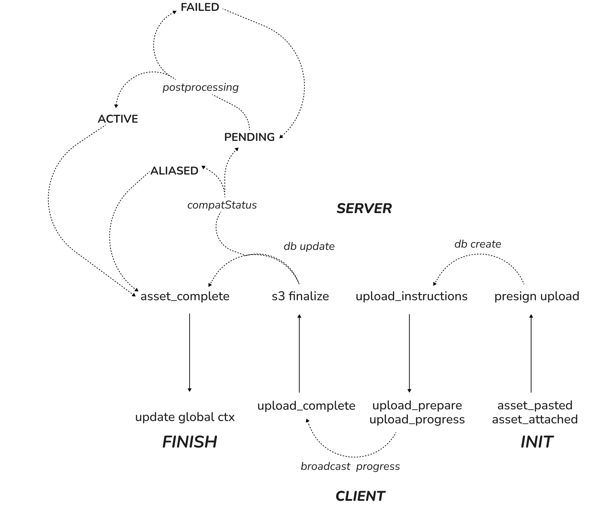

# AI Coalesce Turborepo &mdash; *Slipstream*

## Typical Flows

- Ask a question with attachments:
  1) Client sends `asset_paste`/`asset_attached` → server returns presigned PUT instructions.
  2) Client uploads to S3 → sends `asset_upload_complete` → server finalizes and emits `asset_ready`.
  3) Client sends `ai_chat_request` with `batchId`/`draftId` → server streams `ai_chat_chunk` then `ai_chat_response`.

- Resume a stream after reconnect:
  - Server keeps `stream:state:<conversationId>` in Redis (chunks + metadata). On reconnect, server emits `stream:resumed` and a catch‑up `ai_chat_chunk` built from saved chunks.

---

Questions or improvements? The WS protocol and flows are defined in `packages/types`—start there for changes.

