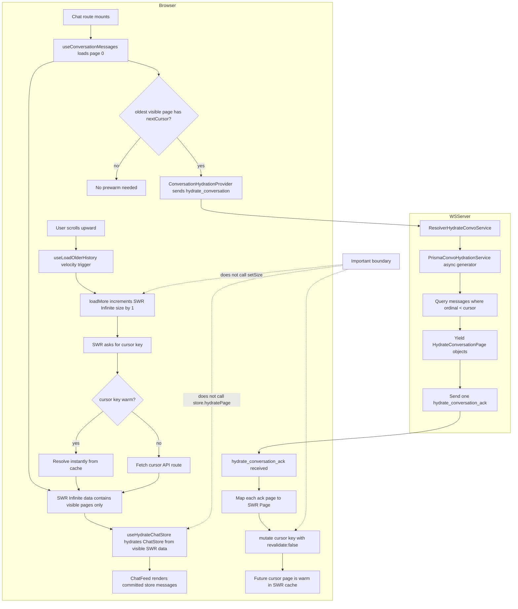

# Conversation Hydration Cache Prewarm

Date: 2026-06-26

Status: implemented in `apps/web-next` (and `apps/web`)

## Summary

Conversation history pagination is split into two paths:

1. Visible pagination remains user-driven. `useLoadOlderHistory` calls `loadMore`
   only when upward scroll velocity crosses the trigger threshold.
2. Background hydration is cache-only. `ConversationHydrationProvider` listens for
   `hydrate_conversation_ack` and writes older pages into SWR cursor keys without
   increasing SWR Infinite `size` and without hydrating the chat store directly.

This keeps the "next page is instant" behavior while avoiding the old
`requestIdleCallback` cascade that loaded every remaining page into the rendered
message list.

## Diagram

## Key Decisions

- The websocket ack is handled by a top-level context, not the pagination hook,
  so the listener is stable and mounted once under `ChatWebSocketProvider`.
- The context uses `client.addListener` rather than `client.on`, because this is
  shared transport plumbing and should coexist with other event consumers.
- `hydrate_conversation_ack.pages` are written to future SWR cursor keys:
  `["cursor", userId, conversationId, cursorOrdinal]`.
- The shared `CONVERSATION_PAGE_SIZE` and page-key builders live in
  `apps/web-next/src/lib/conversation-pages.ts`, keeping the API routes, hook,
  and context aligned.
- The chat store only ingests pages currently present in SWR Infinite `data`.
  Prefetched pages become visible only after the user triggers `loadMore`.
