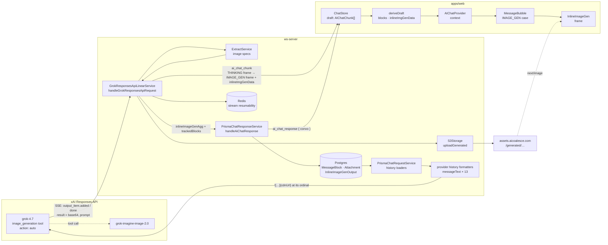
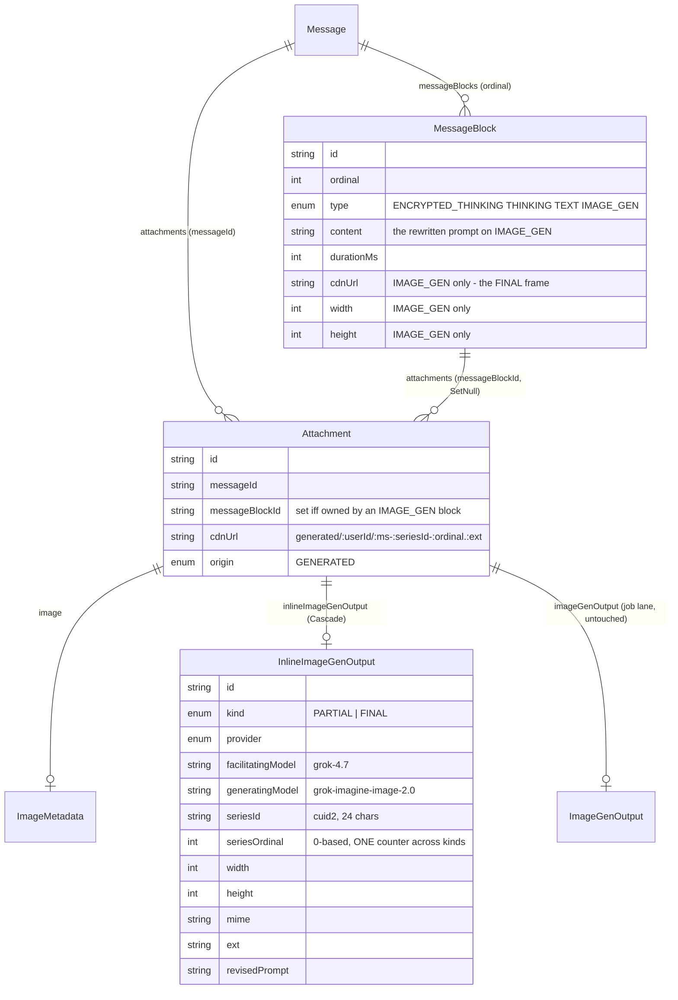
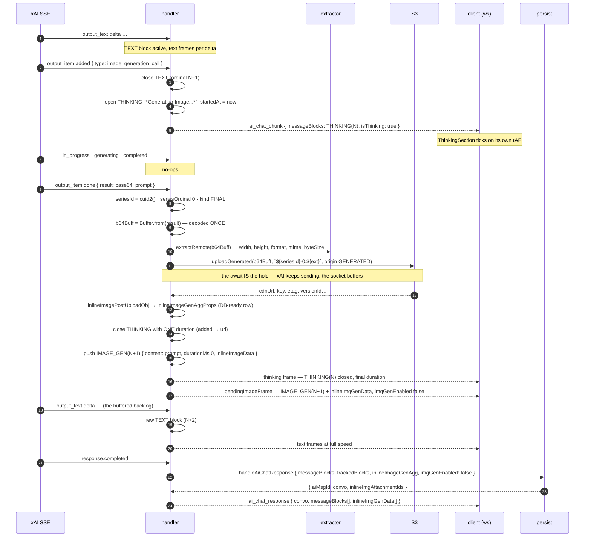
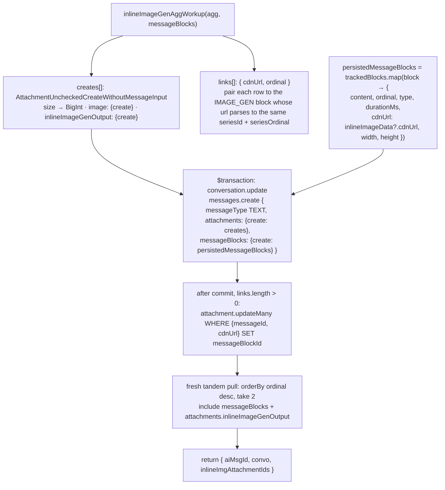
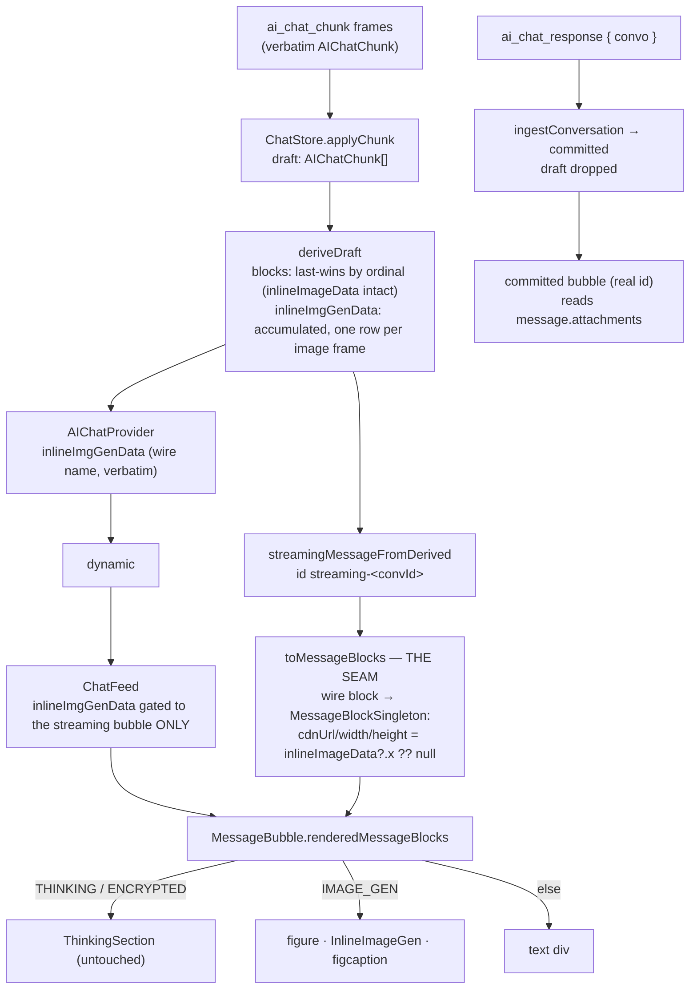

# Inline Image Generation (`IMAGE_GEN` blocks) — System Overview

Date: 2026-09-26

Status: implemented and live in `apps/ws-server` + `apps/web` for Grok 4.6 / 4.7
(first live turn 2026-09-25; last commit `c7506b0`). The OpenAI facilitator
lane is the next consumer and is designed for, not built.

Scope: everything between a provider deciding to draw mid-answer and that image
sitting at the right position in the rendered bubble, the persisted record, and
every other provider's view of the conversation. Design history lives beside
this file (`preliminary.md` §1–11, `example.md`, `example-follow-up.md`,
`reference/`); this document describes what was **built**, and where the build
departed from those plans.

---

## 1. Summary

A chat model with an `image_generation` tool equipped may call it whenever it
likes. The image lands **inside the text at the point the model drew it**, as an
`IMAGE_GEN` message block between the surrounding `TEXT` blocks, with the
model's rewritten prompt as its caption. No job is requested, no toggle is
flipped, no `ImageGenJob` row exists. The message stays a `TEXT` message.

Six ideas carry the design:

1. **Two levels, two facts.** `Message.messageType = IMAGE_GEN` is a
   *request-time* fact (the user asked for an image; a job row was minted before
   the provider was called). `MessageBlockType.IMAGE_GEN` is a *response-time*
   fact (an image occurred at this ordinal because the model chose to). They
   never meet: a spontaneous image is a `TEXT` message containing an
   `IMAGE_GEN` block.
2. **Additive lanes, never "make X optional".** `ImageGenOutput.jobId` stays
   required. A one-off's lineage gets its own table, `InlineImageGenOutput`,
   independent of the job tables. Persist gets its own `else if` arm. The wire
   gets new conditional fields, not widened old ones.
3. **The block is the persisted record and it paints itself.** `MessageBlock`
   carries the three facts a renderer needs — `cdnUrl`, `width`, `height` —
   copied once at persist from the frame the block shows. Text consumers (13
   provider history formatters, the CLI) read the url off the block with no
   join. The attachment row keeps the asset and the lineage.
4. **The url is the join key.** Every generated asset lives at
   `generated/:userId/:ms-:seriesId-:ordinal.:ext`, so whoever holds a `cdnUrl`
   holds the series id, the ordinal and the extension. Persist pairs rows to
   blocks by it; the bubble pairs blocks to rows by it; nothing derivable rides
   the wire.
5. **The wait is a THINKING block.** From the tool call's `added` event through
   generation and the S3 upload, one ordinary `THINKING` block ticks on the
   client. The `IMAGE_GEN` block is only ever sent *with* its url, born closed
   at the next ordinal. `ThinkingSection` was not touched.
6. **Final state is `convo`.** Wire blocks are consumed only during
   `ai_chat_chunk`. At `ai_chat_response` the client ingests the persisted
   conversation and drops the draft; the response's own block and row arrays
   are mirrors nobody reads.

---

## 2. Topology



```
  provider stream                    server                              client
  ──────────────                     ──────                              ──────
  msg_ text deltas ───────────────▶  TEXT block (active) ──────────────▶ text frames
  ig_  output_item.added ─────────▶  close TEXT · open THINKING ───────▶ "Thinking for 0.0s…" ticks
  ig_  in_progress / generating /
       completed                     (no-ops)
  ig_  output_item.done {result} ─▶  decode · specs · await S3 ─────────  (socket buffers; client keeps ticking)
                                     close THINKING (one duration) ────▶ thinking frame, final duration
                                     push IMAGE_GEN {prompt, url, w×h} ▶ IMAGE_GEN frame + inlineImgGenData
  msg_ text deltas (buffered) ─────▶ new TEXT block ────────────────────▶ text frames, at full speed
  response.completed ─────────────▶  persist → ai_chat_response {convo} ▶ draft dropped, convo ingested
```

---

## 3. What the probe established (2026-09-21)

Two identical `grok-4.7` requests, 1,144 and 1,219 SSE events. The handler may
rely on these and nothing else (`preliminary.md` §2):

| Invariant | Consequence |
| --- | --- |
| The `message` item stays **open around the image**; text resumes on the same `msg_` item | the TEXT split around the image is real, and the resumed text is a new block |
| The image is a **five-event burst**: `added`, `in_progress`, `generating`, `completed`, `done`, consecutive | one THINKING block from `added`, one `IMAGE_GEN` block at `done` |
| `result` (base64) and `prompt` (the rewritten prompt) are on **`done` only** | nothing to upload before `done`; `prompt` is the block's `content` |
| Tool items open in parallel and **close out of order**; one can `done` with `status: "failed"` | the handler is order-agnostic; a failed tool item is not an error |
| `tco_` reasoning items are **complete on `added`**; a summarised `rs_` `done` also carries `encrypted_content` | one dedupe `Set`, act on `done` |
| Annotations land mid-text or trailing | never a block boundary |
| Usage carries `image_generation_calls` and `cost_in_usd_ticks` | not yet on the `Usage` type (§13) |
| The tool "uses grok-imagine-image-2.0" and **can chain** (generate then edit) in one request | `generatingModel` is a constant per facilitator; a round may carry several images, each its own series |

Tool equipping (`stream-workup.ts` `resolveResponsesTools`): `image_generation`
with `action: "auto"` is always on for 4.6 / 4.7, like `web_search` and
`x_search`. Free when unused; the model already exercises the judgement.

---

## 4. Data model

Migrations `20260922234809_added_inline_image_gen_output_table` and
`20260924235008_added_cdn_url_width_and_height_to_messageblock`. All additive,
no backfill.



```
 Message (TEXT) ─┬─ MessageBlock 0  THINKING           "…summary…"
                 ├─ MessageBlock 1  ENCRYPTED_THINKING  <ciphertext>
                 ├─ MessageBlock 2  TEXT                "Rendering the keystone…"
                 ├─ MessageBlock 3  THINKING            "*Generating Image...*"     durationMs = added → url
                 ├─ MessageBlock 4  IMAGE_GEN           content = prompt · cdnUrl · width · height
                 │        ▲
                 │        │ messageBlockId
                 ├─ Attachment ──── image (ImageMetadata) ──── inlineImageGenOutput (kind FINAL, series, models)
                 │        also on message.attachments (messageId) — the block is an ordered OWNER, not a replacement
                 └─ MessageBlock 5  TEXT                "…the rest…"
```

Rules the schema encodes:

- **`InlineImageGenOutput` is independent of `ImageGenJob` / `ImageGenOutput`.**
  `kind`, `seriesOrdinal`, dims and both models live here because there is no
  job to carry them; provenance for a one-off must not depend on the parent
  message. `ImageGenOutput.jobId` stays required.
- **`seriesOrdinal` is one counter across kinds** (three PARTIALs → the FINAL is
  3). Deliberately unlike `ImageGenOutput.seriesIndex`, which is per kind. The
  two renderers must never share a sort helper.
- **`width` / `height` / `mime` / `ext` are required.** The extractor knows all
  four before the upload; a nullable column would only encode a bug.
- **Scope of `messageBlockId`:** set on attachments owned by an `IMAGE_GEN`
  block *only*. A user upload has no position in the text and stays linked to
  the message alone. Invariant: `messageBlockId` set ⇔ the block is
  `IMAGE_GEN`.
- **The three block columns are immutable copies**, taken at persist from the
  frame the block shows. Generated assets are `ALIASED` and never re-encoded,
  so the copy cannot drift. The only failure mode is deleting the attachment,
  which leaves a dead url on the block. Invariant: all three set ⇔ `type ===
  "IMAGE_GEN"`, and they describe the FINAL frame. `kind` is **not** on the
  block: a committed block is FINAL by construction.

### 4.1 URL anatomy and series-id shapes

```
 https://assets[-dev].aicoalesce.com/generated/:userId/:timestampMs-:seriesId-:seriesOrdinal.:ext
                                              └ cuid2 ┘ └ 13 digits ┘└─ see table ─┘└ 0…3 ┘

 basename = cdnUrl.slice(cdnUrl.lastIndexOf("/") + 1)      1790010492109-cTygUBM6EZ4cHeSElCCJN-0.webp
 stem     = basename.slice(14, basename.lastIndexOf("."))  cTygUBM6EZ4cHeSElCCJN-0
 seriesId = stem.slice(0, stem.lastIndexOf("-"))            cTygUBM6EZ4cHeSElCCJN      (lastIndexOf: a nanoid may contain "-")
 filename column = `${seriesId}-${seriesOrdinal}.${ext}`    the timestamp prefix belongs to the S3 key, not the row
```

| series id shape | lane | provider tell |
| --- | --- | --- |
| nanoid, 21 chars `[A-Za-z0-9_-]` | Meta `muse-image-1.0`, pure image lanes (jobs) | none |
| `/^ig_[a-f0-9]{50}$/`, 53 chars | OpenAI facilitator **jobs** | certain |
| cuid2, `/^[a-z0-9]{24}$/` | **inline** `IMAGE_GEN` blocks (Grok now, OpenAI inline later) | none |

`apps/web/src/lib/helpers.ts` `toCdnUrlConstituents(cdnUrl)` is the one client
implementation — `{ type, sId, sOrdinal, ext, timestampMs }` with the cuid2
regex **anchored** (unanchored, every `ig_` id contains 24-runs and would read
as inline). No query params, ever. The row is the authority for provider; the
url is diagnostic.

---

## 5. Wire contract

Source: `packages/types/src/contract/ai-chat-events.ts`.

```ts
export type ChatChunkAndResInlineImageData = { width: number; height: number; cdnUrl: string; kind: $Enums.ImageGenOutputKind };

export type ChatChunkAndResMsgBlock<T extends $Enums.MessageBlockType = $Enums.MessageBlockType> = {
  type: T; content: string; ordinal: number; conversationId: string; durationMs: number;
  inlineImageData?: ChatChunkAndResInlineImageData;
};

// distributive: bare ChatChunkAndResBlock is the four-member union;
// inlineImageData is REQUIRED on the IMAGE_GEN arm, optional elsewhere
export type ChatChunkAndResBlock<T extends $Enums.MessageBlockType = $Enums.MessageBlockType> =
  T extends "IMAGE_GEN"
    ? { [Q in keyof ChatChunkAndResMsgBlock<"IMAGE_GEN">]-?: ChatChunkAndResMsgBlock<"IMAGE_GEN">[Q] }
    : { [Q in keyof ChatChunkAndResMsgBlock<T>]: ChatChunkAndResMsgBlock<T>[Q] };

// on AIChatResEntity<T> — cardinality by event, mirroring messageBlocks
messageBlocks?:    T extends "ai_chat_response" ? ChatChunkAndResMsgBlock[] : ChatChunkAndResMsgBlock;
inlineImgGenData?: T extends "ai_chat_chunk"    ? InlineImageGenAggProps    : InlineImageGenAggProps[];
```

| Field | On `ai_chat_chunk` | On `ai_chat_response` | Who reads it |
| --- | --- | --- | --- |
| `messageBlocks` | **one** block per frame; the `IMAGE_GEN` one carries `inlineImageData` (the four paint facts) | the array the server tracked | client draft fold (last-wins by ordinal); CLI paints from chunk blocks; **ignored** at response |
| `inlineImgGenData` | **one** DB-ready attachment row, on the frame that carries the `IMAGE_GEN` block | the array the server collected | client draft fold (accumulated); **ignored** at response |
| `imgGenEnabled` | `false` | `false` | `true` would flip the client into the job lane |
| `convo` | — | the persisted `[AI, user]` tandem, fresh pull after the link | the client's final state |

`InlineImageGenAggProps` is the **create** shape of an `Attachment` row —
`AttachmentSingleton<true>` minus ids, timestamps and relations, plus `image`
and `inlineImageGenOutput` as plain nested objects. Same row, other side of
persist: `message.attachments[i]` after commit carries the same
`inlineImageGenOutput.kind`, `seriesOrdinal`, models and `revisedPrompt`.

Why the nested `inlineImageData` object rather than flat fields: the base type
is wide (`type: $Enums.MessageBlockType`) and nineteen provider handlers build
blocks with that wide discriminant; a discriminated union would stop every one
compiling, and TypeScript cannot couple four independent optionals. The
conditional `ChatChunkAndResBlock` exists for the one handler that wants the
coupling. Flattening the wire onto `cdnUrl / width / height` was designed
(`example-follow-up.md` §9) and deferred.

---

## 6. The handler — one round, linear

`apps/ws-server/src/xai/responses-api-linear.ts`
`handleGrokResponsesApiRequest` (the router imports this file; `responses-api.ts`
currently holds an identical copy pending deletion). Zero closures: block
accounting is `trackedBlocks: ChatChunkAndResBlock[]` (ordinal === index),
`activeBlock: GrokActiveMessageBlock | undefined` (its `type` **excludes**
`IMAGE_GEN` — an open block is never an image), one dedupe `Set`, and eight
inline close sites. Per chunk: `closedBlock`, `pendingImageFrame`, `text`,
`thinkingText`.



Three details worth their own line:

- **Wire order equals block order.** The `IMAGE_GEN` frame is built in the
  `done` branch but *sent after* the bottom-of-loop thinking frame, so the
  closed THINKING (ordinal N) always precedes the image (N+1) on the wire
  (Sol's review #67, `reference/notes.md`).
- **One duration.** The THINKING block's clock runs from `added` to the CDN
  url — generation plus decode plus upload. The `IMAGE_GEN` block has
  `durationMs: 0`; the wait was attributed once.
- **Upload failure is simple.** No `IMAGE_GEN` block is sent; the THINKING
  block still closes honestly; nothing attachment-less reaches the wire.

```
 trackedBlocks after a one-image turn (run 1 of the probe):

   ordinal  type                content
   0        THINKING            47 summary deltas
   1        ENCRYPTED_THINKING  <tco_ ciphertext>          (wire shows "*encrypted output...*")
   2        ENCRYPTED_THINKING  <tco_ ciphertext>
   3        ENCRYPTED_THINKING  <rs_ ciphertext>
   4        TEXT                "…Image incoming with the reading."
   5        THINKING            "*Generating Image...*"    durationMs = added → url
   6        IMAGE_GEN           <799-char prompt>           inlineImageData { 1792, 1008, cdnUrl, FINAL }
   7        ENCRYPTED_THINKING  <rs_ ciphertext>            (the item that opened INSIDE the message)
   8        TEXT                "**CHICAGO, AS READ…**"

 run 2 of the same prompt persisted seven blocks in a different order. Ordinals follow the wire.
```

---

## 7. Persist — own the attachments, write the lineage, link, re-read

`apps/ws-server/src/prisma/chat-response.ts` `handleAiChatResponse`. The job
lane (`mapImgs`) and the audio lane are untouched; inline is a third arm.



- **Two-phase by design.** The message create makes blocks and attachments as
  two independent nested lists, so no block can reference an attachment inside
  that write. The link is one `updateMany` per image *after* the commit, then
  the tandem is re-read so `convo` carries `messageBlockId` and
  `inlineImageGenOutput`. If the process dies between the two, the message
  exists with an unlinked row; the url anatomy makes that recoverable. Accepted
  for a one-off image turn in exchange for an untouched transaction body.
- **The block columns are written from the block's own `inlineImageData`.**
  `?.` on the nested optional; `undefined` means "omit" on a Prisma create, so
  every non-image block is untouched.
- **Rule of three.** The include and the bigint mapping are copied between the
  transaction and the fresh pull. A helper would need a Prisma payload type
  with bigint conversions in its signature; it gets a method at the third site.

---

## 8. Loaders and provider history

Two facts made the image invisible to every provider until 2026-09-24:

1. the request loaders' `attachments.where` admitted generated rows only
   through `imageGenOutput.kind = FINAL`, and an inline row has no
   `imageGenOutput`;
2. no formatter read `IMAGE_GEN` blocks at all.

```
 chat-request.ts — every loader's attachments filter (12 sites, one shape):

   OR: [
     { origin: { not: "GENERATED" } },                                             user uploads
     { AND: [{ origin: "GENERATED" }, { imageGenOutput:       { kind: "FINAL" } }] } job outputs, FINAL only
     { AND: [{ origin: "GENERATED" }, { inlineImageGenOutput: { kind: "FINAL" } }] } inline outputs, FINAL only  ← the twin arm
   ]
   messageBlocks: { orderBy: { ordinal: "asc" } }        block order now carries the image's position
   includeGamma:  image · document · audio · imageGenOutput · audioGenOutput · inlineImageGenOutput · messageBlock
   mapping:       inlineImageGenOutput ?? undefined · messageBlock ?? undefined   (Prisma null → singleton's optional)
```

Every provider history formatter (xAI, OpenAI, Meta, Sakana, zai, MiniMax,
Mistral, DeepSeek, Kimi, Gemini, Anthropic, Vercel, Cohere, Alibaba) is one
linear method — objects, arrays and `let`s gated in order, the xAI shape — and
follows two rules:

```
 messageText(msg):                                    the assistant attachment loop:
   for block of msg.messageBlocks (ordinal asc)          for att of msg.attachments
     TEXT      → block.content                             if (att.messageBlock) continue   ← owned by an IMAGE_GEN block;
     IMAGE_GEN → `![[provider/model]-WxH](block.cdnUrl)`                                         messageText already placed it
                 + "\n\n" + block.content (the prompt)     …else the markdown link/image as before
     THINKING / ENCRYPTED_THINKING → skipped
```

So the model that drew the image, and every other model that later joins the
conversation, sees `` **once, at the position it occurred**, with the
prompt under it. Native `input_image` parts remain reserved for the current
user turn's fresh uploads, exactly as before; a prior turn's image is a url in
text for every provider.

The client-facing producers (live commit, page-0, cursor, WS prewarm) all
include `inlineImageGenOutput` and `audioGenJob` beside `imageGenJob`, so a
reload returns the same attachment shape as a live commit.

---

## 9. The client



**One block shape at the bubble.** `toMessageBlocks` is the only place the wire
block and the DB row meet. Its wire branch maps the nested `inlineImageData`
onto the singleton's three columns with `?? null`; its DB branch spreads the
row. The singleton never carries a non-schema field, and the bubble reads
`block.cdnUrl / width / height` whether the block came off a frame or out of
Postgres.

**The `IMAGE_GEN` case** (between the thinking branch and the text fallback,
keyed by ordinal like the thinking branch):

```tsx
if (block.type === "IMAGE_GEN") {
  if (!block.cdnUrl || !block.width || !block.height) continue;   // sent only with its url
  const row = (inlineImgGenData ?? message.attachments).find(a => a.cdnUrl === block.cdnUrl);
  const kind = row?.inlineImageGenOutput?.kind ?? "FINAL";        // FINAL: the hydrated-block invariant
  const attachmentId = row && "id" in row ? row.id : undefined;   // the committed anchor
  rendered.push(
    <figure key={`${message.id}-image-${block.ordinal}`} className="my-3 flex flex-col gap-2">
      <InlineImageGen isGenerating={kind === "PARTIAL"} images={[block.cdnUrl]} currentImageIndex={0}
                      width={block.width} height={block.height} prompt={block.content} kind={kind}
                      {...(attachmentId ? { attachmentId } : {})} />
      <figcaption className="text-xs opacity-80">
        {isStreaming ? processStreamingMarkdown(blockContent)
                     : (renderedBlockContent[blockOrdinalKey(block.ordinal)] ?? blockContent)}
      </figcaption>
    </figure>
  );
  continue;
}
```

- **`kind` is dynamic, never a literal.** Streaming: the frame's DB-ready row
  from `inlineImgGenData`. Committed: the persisted row. Both carry
  `inlineImageGenOutput.kind` and both carry `cdnUrl`, and the block's url is
  the frame it shows — one `find`, one join key, both paths. An OpenAI PARTIAL
  frame later carries its own row and url with `kind: "PARTIAL"`; the block's
  url moves to it; the find matches; the scanner shows.
- **The caption is the prompt through the bubble's renderer of the moment** —
  `processStreamingMarkdown` live, the lazy `processMarkdownToReact` pass once
  committed. Neither renderer file was touched; the committed pass already
  processed every block with content.
- **The parent owns `<figure>` / `<figcaption>`; the component is the frame.**
  `ThinkingSection`'s contract.
- **Bubble width** claims 85% from the first image frame via an `IMAGE_GEN`
  block disjunct. An inline turn has no attachments while streaming, so without
  it the bubble shrink-wrapped to its text and jumped at commit.
- **Perf invariant kept.** `inlineImgGenData` reaches only the streaming
  bubble; committed bubbles get `undefined`, so their `memo` holds per token.
  The bubble never reads the context itself.

**`InlineImageGen`** (`ui/chat/inline-image-gen/index.tsx`) is the job canvas
carried over nearly whole — ref-gated display state, `kind`-driven PARTIAL
scanner and corners, FINAL-only hover overlay, `shimmer` blur — with the frame
sized from the real pixels:

```
 frameStyle:  aspect-ratio: <w> / <h>          the ratio is never violated by a clamp
              width: min(100%, <w>px)          never upscaled past native; shrinks on a narrow column
 footprint reserved on the FIRST paint (raw props before the latched w/h land) → text beneath never reflows
 onLoad natural-size fallback for ratio-only job requests (`ar` prop) — irrelevant to inline, kept for reuse
 alt = the prompt · download name = `${sId}-${sOrdinal}.${ext}` (the filename column, via toCdnUrlConstituents)
 the block lane is a one-frame series: images={[block.cdnUrl]}, currentImageIndex={0}
```

**Commit is not a race.** `applyResponse` ingests `convo` (the post-link fresh
pull), drops the draft, then flips status — one synchronous method, one
batched render, and the streaming (`streaming-<id>`) and committed (real id)
bubbles are different component instances. No hydration flag is needed.

---

## 10. Invariants, in one place

| Invariant | Enforced by |
| --- | --- |
| `Attachment.messageBlockId` set ⇔ its block is `IMAGE_GEN` | persist links only inline rows; user uploads never carry it |
| `MessageBlock.cdnUrl / width / height` set ⇔ `type === "IMAGE_GEN"`, and they describe the FINAL frame | `persistedMessageBlocks` copies from `inlineImageData` only |
| An `IMAGE_GEN` block is only ever sent *with* its url | the handler pushes it after the upload resolves |
| A committed `IMAGE_GEN` block is FINAL | the bubble's `?? "FINAL"` fallback is this invariant, not a guess |
| Wire blocks are consumed only on `ai_chat_chunk`; final state is `convo` | `applyResponse` ignores the response's arrays; the CLI reconciles from `convo` |
| `seriesOrdinal` is one counter across kinds | `InlineImageGenOutput` unique `[seriesId, seriesOrdinal]` |
| Inline rows are FINAL-only in provider history | the loaders' twin arm |
| An inline image appears once in any provider's history, at its ordinal | `messageText` places it; the assistant loop skips `att.messageBlock` |
| The wire carries nothing derivable from the url | `inlineImageData` is `{ width, height, cdnUrl, kind }` |
| `imgGenEnabled` is `false` on every inline frame | `true` is the job lane's signal |
| No provider check anywhere on the render path | the component reacts to `kind` alone, as the job canvas does |

---

## 11. File map

| Concern | Path |
| --- | --- |
| Schema | `packages/db/prisma/schema/inline-image-gen-output.prisma`, `messageblock.prisma` (`IMAGE_GEN`, `cdnUrl`/`width`/`height`), `attachment.prisma` (`messageBlockId`, `inlineImageGenOutput`) |
| ERD | `packages/db/erd/ERD.mmd` — the source of truth for what a singleton may carry |
| Wire contract | `packages/types/src/contract/ai-chat-events.ts` (`ChatChunkAndResBlock`, `InlineImageGenAggProps`, `inlineImgGenData`) |
| Singletons | `packages/types/src/types.ts` (`MessageBlockSingleton.attachments?`, `AttachmentSingleton.inlineImageGenOutput?` / `messageBlock?`) |
| Event types (probe-derived) | `apps/ws-server/src/xai/event-types.ts` |
| Tool equipping | `apps/ws-server/src/xai/stream-workup.ts` (`resolveResponsesTools`) |
| Handler | `apps/ws-server/src/xai/responses-api-linear.ts` (`handleGrokResponsesApiRequest`); `responses-api.ts` is a pending-deletion twin |
| DB-ready row builder | `apps/ws-server/src/xai/base.ts` (`inlineImagePostUploadObj`) |
| Handler-local types | `apps/ws-server/src/xai/responses-types.ts` (`GrokActiveMessageBlock`, `InlinePostImageUploadProps`) |
| Router | `apps/ws-server/src/xai/index.ts` (`routeXai`) |
| Persist | `apps/ws-server/src/prisma/chat-response.ts` (`inlineImageGenAggWorkup`, third arm, link + fresh pull) |
| Request loaders | `apps/ws-server/src/prisma/chat-request.ts` (twin arm, `includeGamma`, ordered blocks) |
| WS prewarm producer | `apps/ws-server/src/prisma/convo-hydration.ts` |
| xAI history | `apps/ws-server/src/xai/stream-workup.ts` (`messageText`, `formatxAIMsgHistory`) |
| Other histories | `openai/{workup,memory}.ts`, `meta/workup.ts`, `sakana/workup.ts`, `zai/memory.ts`, `minimax/memory.ts`, `mistral/memory.ts`, `deepseek/memory.ts`, `kimi/memory.ts`, `gemini/interactions.ts`, `anthropic/vector-store.ts`, `vercel/index.ts`, `cohere/index.ts`, `alibaba/memory.ts` |
| Web loaders | `apps/web/src/orm/user-message-service.ts` |
| Store + derivation | `apps/web/src/state/chat/store.ts`, `apps/web/src/lib/draft-to-message.ts` |
| The seam | `apps/web/src/lib/ui-message-helpers.ts` (`toMessageBlocks`) |
| Context → feed → bubble | `apps/web/src/context/ai-chat-context.tsx`, `ui/chat/dynamic/index.tsx`, `ui/chat/chat-feed/index.tsx`, `ui/chat/message-bubble/index.tsx` |
| The frame | `apps/web/src/ui/chat/inline-image-gen/index.tsx` (+ `notes.md`, the figure/figcaption pattern) |
| URL anatomy (client) | `apps/web/src/lib/helpers.ts` (`toCdnUrlConstituents`) |
| Job canvas (untouched) | `apps/web/src/ui/chat/image-gen/index.tsx` (+ `image-generation-canvas.tsx`, `series-stack.tsx` kept for partial replay) |
| CLI | `packages/cli/src/render.ts` (`renderResponse` reconciles from `convo`) |
| Probe artefacts | `apps/ws-server/grok-4-7-probe.sh`, `src/test/xai/tooling/grok-4.7{,-2}.txt` |

---

## 12. Key decisions

- **A spontaneous image is a block on a `TEXT` message, not an image message.**
  Request-time and response-time facts stay at their own levels.
- **`InlineImageGenOutput` over a nullable `jobId`.** The job tables keep
  meaning "promised"; the one-off gets its own lineage row.
- **Items, not blocks.** The design was reasoned from provider items and the
  fields the client paints; blocks are the persisted record, never the design
  model. The wire field is what the renderer consumes plus one join key.
- **Singletons mirror the DB, nothing more, nothing less.** No UI-only field
  ever landed on a singleton; when the client needed `cdnUrl`/`width`/`height`
  on the block, the columns went into the schema first.
- **The block paints itself; the row explains it.** Three immutable columns on
  the block for every text and render consumer; kind, series, models and prompt
  on the attachment's lineage row.
- **The url is the join key, in both directions, both paths.** Persist pairs by
  it, the bubble pairs by it, nothing derivable rides the wire.
- **One THINKING block from `added` to the url.** The wait is shown truthfully
  by an untouched component; the image is born closed. The upload `await` is
  the hold; the socket buffers; the backlog streams through afterwards. Text
  pacing, if wanted, is the client's job.
- **Wire order equals block order** — the image frame waits for its THINKING
  close frame.
- **Final state is `convo`.** The response's block and row arrays are mirrors.
- **Two-phase persist, post-commit link, fresh re-read.** The transaction body
  stays untouched; the window is named and accepted.
- **Copy twice, abstract at the third use.** Never a helper whose parameter is
  a Prisma payload type with bigint mapping inside.
- **Linear handlers and formatters.** Objects, arrays and `let`s gated in
  order; no closure helpers; the nine-helper chains GPT left in Meta and Sakana
  were collapsed back into one method each.
- **Additive wire fields, conditional on `type`.** `ChatChunkAndResBlock`
  couples `inlineImageData` to the `IMAGE_GEN` arm without breaking nineteen
  wide-discriminant producers.
- **`kind` reacts, provider never decides.** Grok is FINAL by construction,
  OpenAI will be PARTIAL until FINAL; the component asks neither who sent it.

---

## 13. Known gaps and next

- **OpenAI inline lane.** Designed for, not built: equip `image_generation` on
  the OpenAI *chat* path, mint cuid2 series ids, re-send the same ordinal per
  PARTIAL then FINAL. The bubble's url join, the frame's PARTIAL styling, the
  loaders' FINAL filter and the persist pairing by series+ordinal are ready.
  `kind` for a live PARTIAL comes from `inlineImgGenData` on the frame;
  nothing on the singleton needs to change.
- **`responses-api.ts` twin.** Holds a whitespace-identical copy of the linear
  service; the router imports `-linear`. One of them goes (spec commit G).
- **Text pacing (spec §10.11 j).** The backlog buffered during the upload lands
  at full speed. rAF-coalescing `applyChunk` is the cheap first step; metering
  is a follow-on. Not needed for correctness.
- **Sol's review items, owner's call** (`reference/notes.md`): the
  `responseOutput` sentinel (stringifies a base64 image per round → a boolean),
  a `controller.abort()` in `finally`, `TOOL_DEADLINE_MS` (time-bound only —
  no token caps), `chunk: revisedPrompt` on the image frame (inert), and a
  cleanup policy for an S3 object orphaned by a mid-stream failure.
- **`Usage` type** lacks `cost_in_usd_ticks`, `image_generation_calls`,
  `context_details`.
- **Residue to prune:** `GrokActiveMessageBlock.inlineImageData?` and
  `GrokFinalizedMessageBlock` (unreachable now that the active type excludes
  `IMAGE_GEN`); `MetaAttachmentRef` / `MetaFreshAssetSelection` /
  `SakanaAttachmentRef` / `SakanaFreshAssetSelection` exports with no readers.
- **The frame's Eye button** has no handler (inherited from the canvas); a
  lightbox is a later feature.
- **HMEM never sees the image.** Memory indexing reads `msg.content`; whether a
  fold should carry "an image of X was generated here" is a separate decision.
- **Alt text names the facilitator.** `messageText` writes
  `[provider/model]`; the row's `generatingModel` (`grok-imagine-image-2.0`)
  is the more precise provenance if it ever matters to a model reading history.
