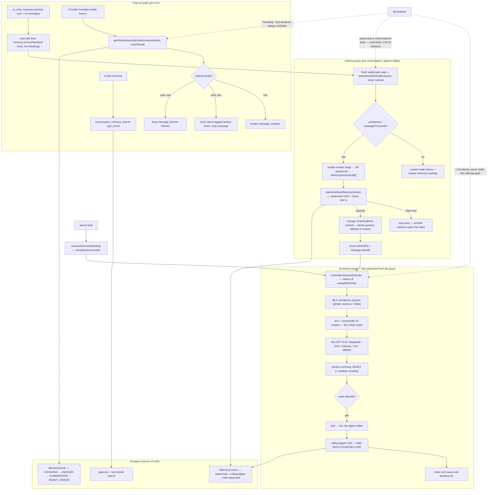

# HMEM — Horizon-Mediated Episodic Memory

Date: 2026-07-11

Status: live in `apps/ws-server` (MoE roster live 2026-07-10; §8.5 semaphore + delta fold landed)

## Summary

HMEM turns every conversation into a self-condensing archive. The name is
literal: a set of horizons mediates which episodes consolidate — the indexing
horizon trails the conversation tip so sections never chase the live exchange,
and the founding-window ceiling and live-window floor bound which consolidated
episodic traces may substitute into provider history. It is one subsystem with
one write path and three read paths, all owned by
`ConversationMemoryVectorService` (`apps/ws-server/src/memory/`):

1. **Write path (indexing → summarizing → folding).** After each turn
   persists, `onTurnPersisted` runs a fire-and-forget indexing pass. The pass
   reads the conversation's watermark fresh from Postgres (never cached
   in-process), renders the unindexed ordinal range to markdown, cuts it into
   token-budgeted sections with a DP sectionizer, and claims each section via
   a **watermark CAS + chunk insert in one transaction** — claims must be
   contiguous from the watermark, so overlaps and gaps are impossible by
   construction and losing a claim means another instance owns the chain.
   Claimed sections are embedded through Voyage contextualized embeddings
   (family-packed so each vector is minted knowing its siblings), then
   summarized by the **§6.2 MoE roster** — `chunkIndex % rotation` picks the
   arm deterministically across Sol (GPT-5.6) and five gateway arms
   (deepseek/kimi/minimax/zai/alibaba), each running the shared uncapped,
   deadline-bounded tool loop. When a wave of section summaries drains, the
   **fold** routes to Sol (the digest editor — "Sol remembers, sonnet logs")
   and merges new READY sections into the context's rolling digest under its
   own CAS and generation-time watermark.
2. **Read path A — substitution assembly (Part II §2).** Every provider
   formatter drives its history loop through `getHistoryAssemblyView`:
   the oldest `foundingWindowMessages` ordinals and the newest
   `liveWindowMessages` ordinals always render verbatim (primacy and recency
   anchors); READY sections bridging the middle replace their message ranges
   with name-tagged summary blocks. `claim(ordinal)` returns verbatim / emit
   block / drop — the serial-position shape with zero formatter special-casing.
3. **Read paths B and C — deliberate retrieval.** Chat models dual-wield
   `conversation_memory_search` (hybrid vector + text, scoped to the current
   conversation or all, pg_trgm title filter) and
   `conversation_memory_get_chunk` (by id or ordinal, previous/next paging)
   inside every provider's tool loop. The summarizer arms get the same tools
   plus `file_search`, so sections are summarized with reunification available.

Concurrency is bounded at two levels: cross-instance safety is the
watermark/summary-state CAS in Postgres; per-instance fan-out is the **§8.5
global FIFO semaphore** (`SummaryJobSemaphore`) capping concurrent summarizer
LLM calls — sections and folds, across all conversations — so the boot-time
`resumeSummaryBacklog` sweep cannot blow provider OTPM with
`contexts × sweepBatchSize` simultaneous calls.

## Diagram

## Key Decisions

- **The watermark is the concurrency primitive.** `MemoryContextRegistryEntry`
  caches immutable ids only; `lastIndexedOrdinalExclusive` is read fresh every
  pass and advanced only through the claim CAS. Multiple ws-server instances
  coexist without locks — a lost claim is a normal stop, not an error.
- **Sections are cut by dynamic programming against exact Voyage token
  counts** (`targetSectionTokens` band, heading allowance reconciled at
  assembly) so section boundaries are stable, budgeted, and reproducible.
- **Contextualized embedding families**: fresh sections embed together with
  already-INDEXED neighbors re-embedded as `isRefresh` members, so old vectors
  gain the new siblings' context. Family (≤32k) and request (≤120k) token
  budgets are probe-verified hard caps.
- **§6.2 MoE roster**: per-chunk arm is `chunkIndex % rotation` — deterministic,
  stable across retries, and every row records its arm's receipts (model,
  usage, tool rounds) for the ongoing audition. `rawTranscriptAb` runs a
  factorial content-delivery experiment striped so the variant bit never
  confounds arm identity. Folds pin to one arm (Sol) because sections are
  parallel workers and the fold is an editor.
- **No output caps on arms** (house rule): gateway arms omit `max_tokens`
  entirely; first-party arms pin the required param at the model ceiling.
  `finish_reason === "length"` is logged as the receipt if a provider applies
  a hidden default. Runaway calls are bounded by wall-clock
  (`callDeadlineMs` aborts) — time, never tokens.
- **§8.5 semaphore**: one in-process FIFO counting semaphore
  (`maxConcurrentSummaryJobs`) covers sections *and* folds across all
  contexts; slots hand off directly to waiters. Cross-instance safety stays
  with the CAS — the semaphore only tames per-instance fan-out.
- **Fold discipline**: folds land in `chunkIndex` order under a CAS on
  `rollingSummaryUpdatedAt`; the fold watermark (`foldedThroughGeneratedAt`)
  orders by generation time so selection and watermark share one ordering. The
  `foldInputBudgetTokens` gate drops the live tail first, then defers with a
  warning — a fold overflow would otherwise retry identically forever.
- **Assembly is a claim protocol, not a merge pass.** Formatters stay pure:
  one `claim(ordinal)` call per message; the founding-window exemption is
  baked into the coverage map so emission lands at each section's first
  non-exempt ordinal with no special cases downstream. Substituted blocks are
  name-tagged `[provider/model]` — the fleet notation, so models see who
  remembered what.
- **Self-healing over exactness**: embed failures roll back to a reclaim pool;
  stale CHUNKING/SUMMARIZING claims rejoin retry pools after
  `staleClaimMinutes`/`staleSummaryMinutes`; retries cap into ERROR rather
  than looping. The backlog sweep runs on every below-threshold pass and at
  boot, so a crashed instance's work is finished by the next one.
