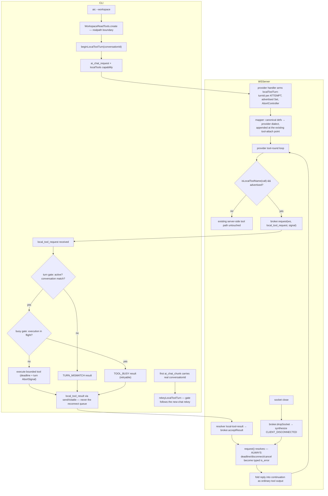

# Local Read-Only Tool Bridge

Date: 2026-07-17

Status: implemented and live-verified across twelve providers (anthropic
`7ab7c10`, openai `033d86b`, gemini `3c68f1a`, xai `7cd3a78`, mistral
`44a47ac`, kimi + deepseek + zai + minimax + alibaba + sakana + cohere
2026-07-18). Meta/llama is rewritten and bridge-wired (`634109c`, mistral-layout
chain) but unverifiable — the Llama API currently serves an empty
model roster on this key (models.list() returns [], every model id
400s), so reinstatement waits on Meta or an AI Gateway re-route.
Vercel/v0 is out of scope (the v0 API was dismantled upstream in March
with no announcement — the integration is a lingering appendage,
deliberately untouched).

## Summary

The bridge lets a provider model, mid-stream on the ws-server, read the
operator's local workspace through the connected CLI. Three tools cross the
boundary: `repo_search` (ripgrep), `read_file` (bounded line ranges),
`list_directory` (bounded traversal). The flow is split into three planes:

1. **Contract** (`packages/types/src/local-tools.ts`) — provider-neutral.
   Canonical tool definitions constrained to a portable schema intersection
   (`CanonicalSchemaProperty`: flat object, `string`/`integer`/`boolean`
   leaves, `description`, `required`), compiler-enforced so a future tool
   cannot drift into schema some provider cannot express. Two
   `EventTypeMap` members: `local_tool_request` (server→CLI) and
   `local_tool_result` (CLI→server) — "request" names who asks, roles
   invert. `ai_chat_request` gains an optional `localTools` capability
   (`{ protocolVersion: 1, names }`).
2. **CLI executor** (`packages/cli`) — dormant unless `--workspace` opts in
   (bare flag autodetects the git root; explicit values are literal; an
   empty value stays dormant). `WorkspaceReadTools` enforces double
   containment (syntactic path check, then realpath) with every dimension
   bounded; `CliLocalToolsService` gates each request (active turn,
   conversation match, one execution at a time) and answers with exactly
   one `local_tool_result` per request.
3. **Server broker + provider dispatch** (`apps/ws-server`) —
   `LocalToolBroker` owns a socket-scoped pending map and per-tool budgets
   (`repo_search` 15s, others 7.5s). Each provider maps the canonical
   definitions into its native dialect at its existing tool-attach point
   and dispatches bridge calls inside its existing tool-round loop, before
   the server-side tool fallback.

## Diagram

## Provider Mappers

| Provider  | Dialect mapping                                                                | Dispatch site                                  |
| --------- | ------------------------------------------------------------------------------ | ---------------------------------------------- |
| anthropic | near-identity `input_schema`; `allowed_callers: ["direct"]`                    | existing PTC round loop, before unknown-tool    |
| openai    | Responses `FunctionTool`, near-identity, `strict: false`                       | function-call loop in responses-chat           |
| gemini    | `Type`-enum Schema walk; `minLength`/`maxLength` → int64 strings; `additionalProperties` dropped | round loop in chat.ts; synthesizes a correlation id when `functionCall.id` is absent |
| xai       | `LocalToolFunctionTool` — canonical `inputSchema` IS the payload               | round loop; rides the `canUseFunctionTools` gate (multi-agent gets none) |
| mistral   | completions dialect, near-identity                                             | materialized-tool-call loop; string-arguments parse guard |
| kimi      | gateway completions dialect, near-identity (`KimiLocalToolFunctionTool`)       | materialized-tool-call loop; broker precedes the optional apiKey in the ctor |
| deepseek / zai / minimax / alibaba | gateway completions dialect, near-identity (per-provider `*LocalToolFunctionTool`) | kimi's exact stamp — materialized-tool-call loop, broker before optional apiKey |
| sakana    | OpenAI Responses dialect — the openai mapper verbatim (`strict: false`, `"required" in` narrowing) | function-call loop in chat.ts; fugu calls tools before its first chunk (pre-rekey adoption exercised) |
| cohere    | `Cohere.ToolV2` (v2 SDK), near-identity                                        | single-class service; rides the `isToolCapable` gate; optional `function?.name` guard |

Each mapper lives beside that provider's existing native tool definitions.
There is no general JSON-Schema transpiler — the canonical intersection
makes every mapping total and mechanical.

## Key Decisions

- **`turnId` is an opaque, server-minted, per-ATTEMPT identity** (`"turn_"`
  + lazy nanoid). Not derived from `userMsgId`: retry/regenerate flows
  reuse the message id across attempts, and the correlation unit is the
  attempt. Semantics (provider/model/round) are typed fields composed at
  print time, never parsed out of the identity string.
- **`timeoutMs` is relative wall-clock budget**, never an absolute epoch —
  each side computes its own local deadline from arrival time, so
  server/CLI clock skew can neither pre-expire nor over-extend a request.
- **`broker.request()` always resolves.** Deadline, disconnect, and cancel
  become typed `is_error` results folded back to the model as ordinary
  tool output, so the provider round loop can never wedge on an await —
  and models self-correct on typed errors (observed live with
  `EXEC_FAILED`).
- **Results ride `sendVolatile`, never the reconnect queue.** A tool result
  is a volatile reply to a pending promise on one exact socket; replaying
  a stale result after reconnect is actively wrong — the broker
  synthesizes `CLIENT_DISCONNECTED` instead.
- **`parallel_tool_calls` stays on** where providers offer it. The server
  awaits bridge calls sequentially inside its round loop, and the CLI's
  busy gate rejects genuine overlap with a retryable `TOOL_BUSY`.
- **Capability is per-turn and default-dormant.** No `--workspace`, no
  `localTools` field, zero definitions attached server-side; a stray
  request is rejected as `TURN_MISMATCH`. The new-chat→real-id rekey is
  followed by the CLI's turn gate, or every request in a fresh
  conversation would mismatch.
- **Pre-rekey adoption.** A model may call tools before the first
  `ai_chat_chunk` lands (glm-5.1 does — straight to tool calls, zero
  preceding chunks), so a turn still keyed to `"new-chat"` adopts the
  real conversationId from its first request. Same trust model as the
  chunk-driven rekey: one armed turn per socket, server-minted id.
  Without it the gate TURN_MISMATCH-looped an entire turn (observed
  live: glm-5.1 retried the mismatch 290+ rounds before the fix).
- **`allowed_callers: ["direct"]` on anthropic is a security boundary, not
  syntax** — local filesystem reads are model-direct only for the alpha; a
  PTC loop programmatically firing filesystem reads is a capability
  escalation the one-call-at-a-time audit story doesn't cover. Parity
  later is a one-line change made from evidence.
- **Time is the only real bound.** Tool rounds carry the 10M backstop like
  every chat loop; per-call deadlines and the turn-scoped AbortController
  (the future cancellation hook) are the operative limits.
