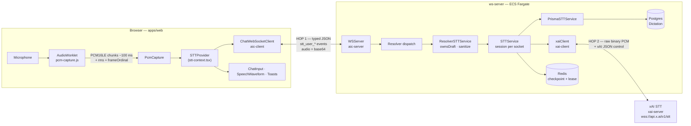
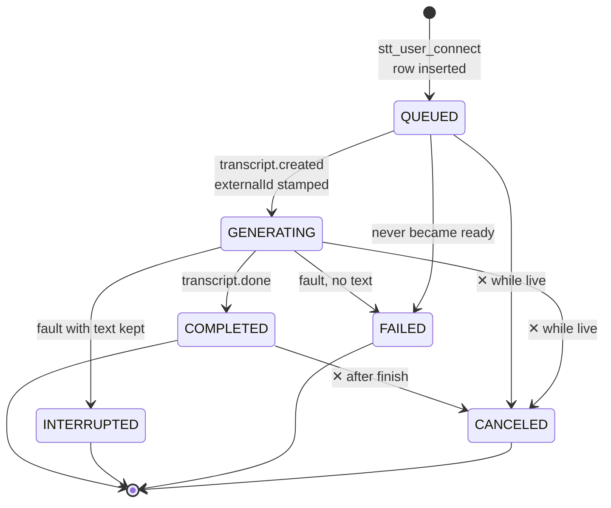
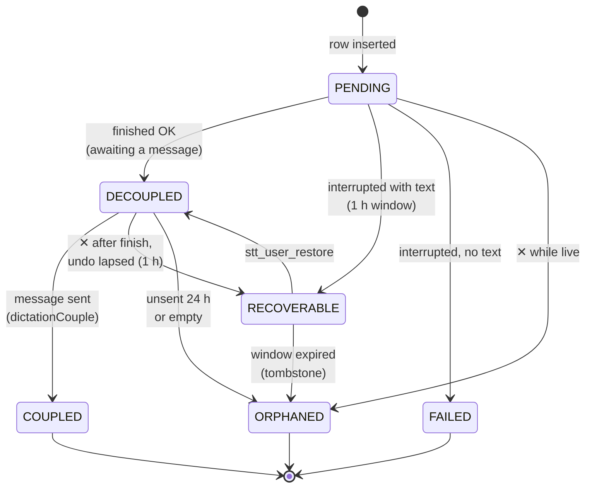
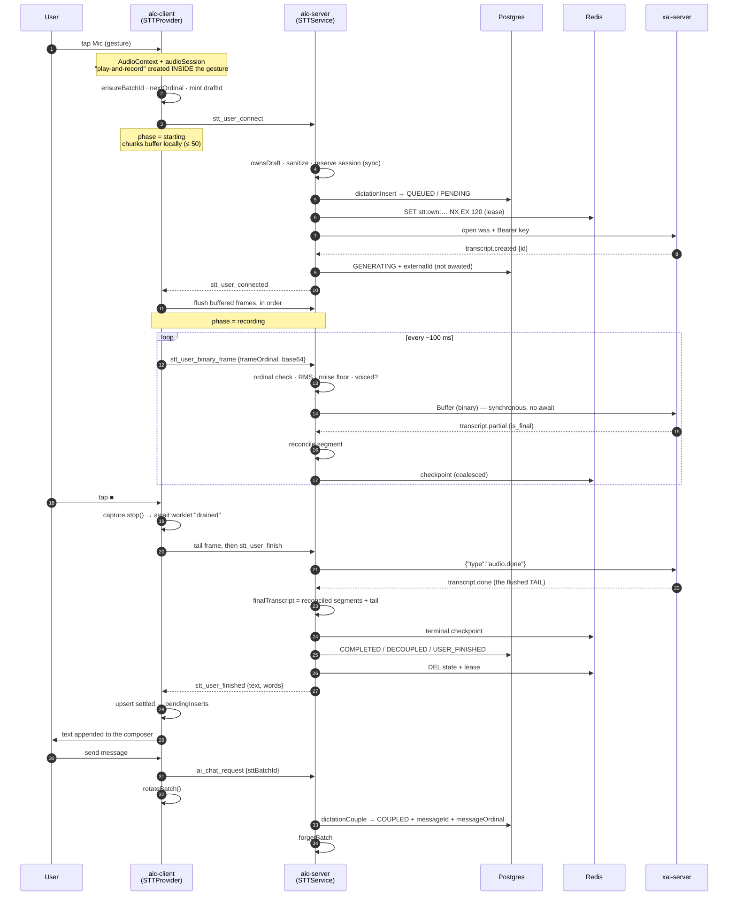
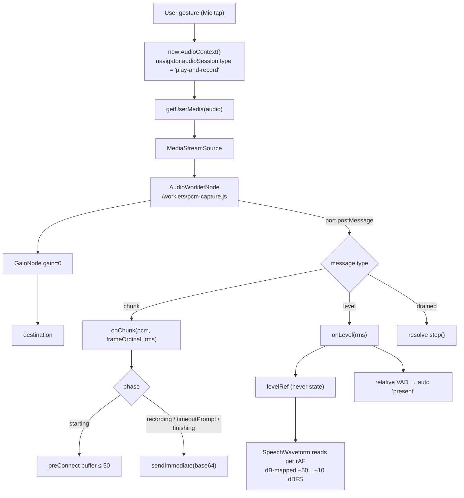
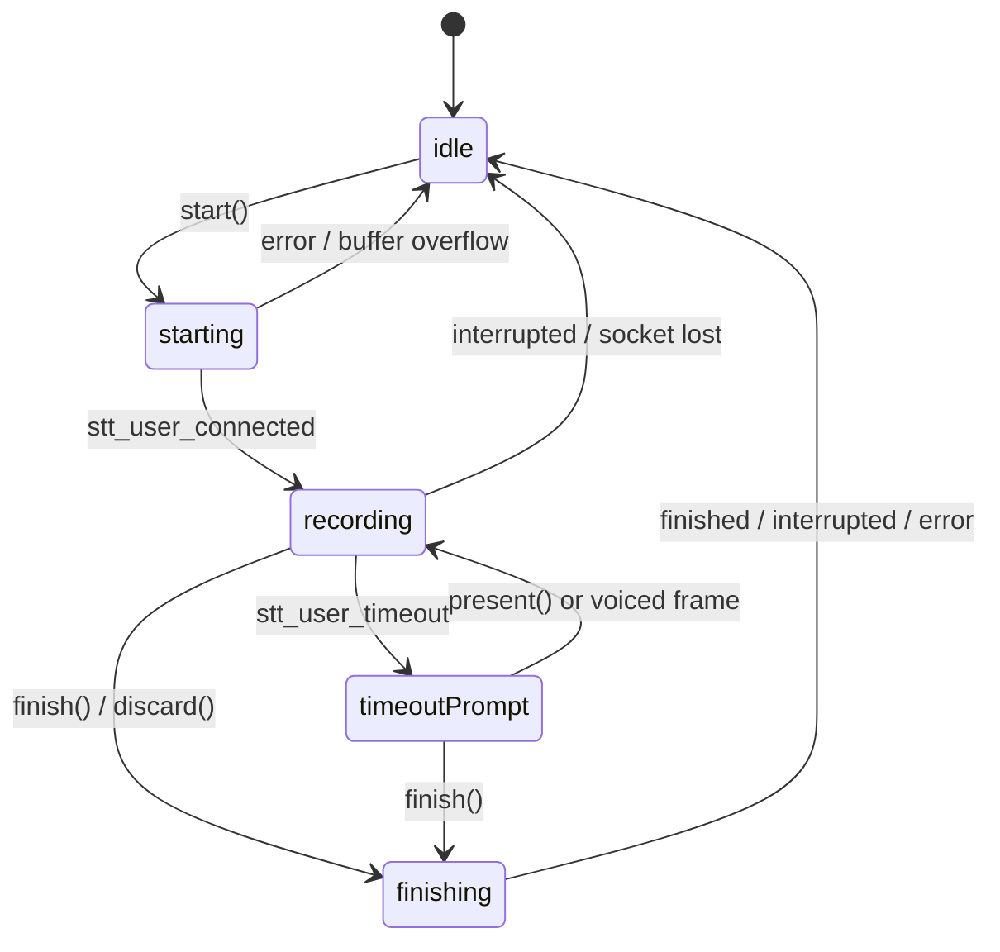
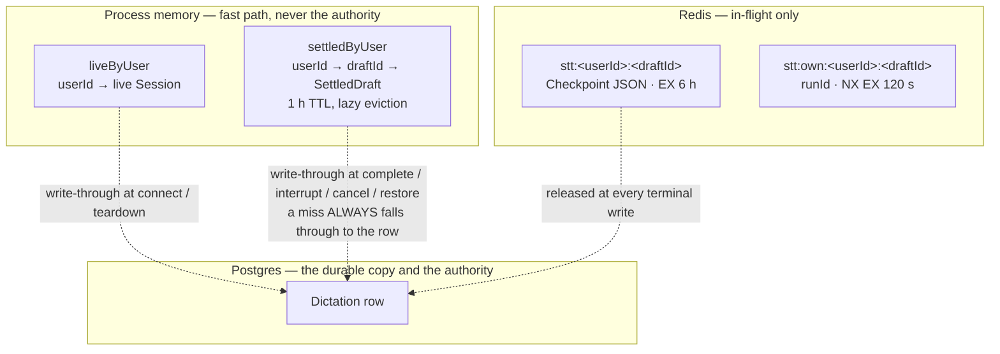
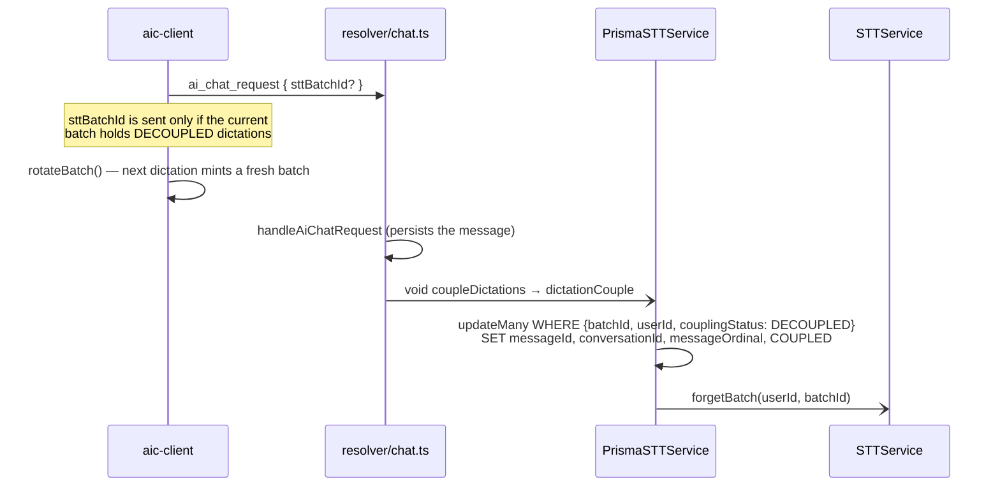
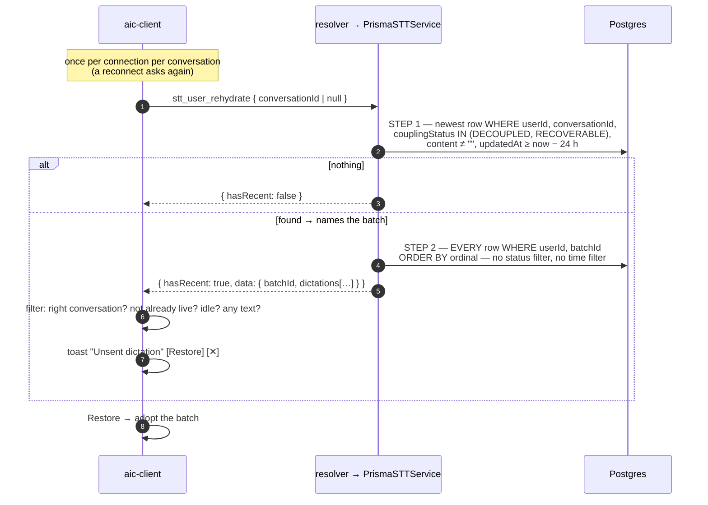

# Speech-to-Text (Dictation) — System Overview

Date: 2026-09-19

Status: implemented and live in `apps/ws-server` + `apps/web` (M1 shipped to prod
2026-09-17; idle probe, toasts, housekeeping and the rehydrate lane landed
2026-09-18/19, last commit `f52dbc1`)

Scope: everything between the microphone and a `Dictation` row coupled to a
`Message`. Design history lives beside this file (`astra-init.md`, `fable-1.md`,
`plan-formalized.md`); this document describes what was **built**, and where the
build deliberately departed from those plans.

---

## 1. Summary

Dictation streams microphone audio to xAI's streaming STT endpoint
(`wss://api.x.ai/v1/stt`) and lands the transcript in the chat composer. It does
this **without a second browser socket and without exposing the xAI key**: audio
rides the existing authenticated chat WebSocket to ws-server, which relays it to
xAI over a server-side socket it owns.

Five ideas carry the whole design:

1. **Four-node relay, two hops with different wire formats.** Hop 1 (browser ⇄
   ws-server) is 100% typed `stt_user_*` JSON events — audio included, as base64.
   Hop 2 (ws-server ⇄ xAI) is raw binary PCM plus xAI's own JSON control frames.
2. **The client mints identity, the server owns truth.** The browser mints a
   `draftId` that encodes `userId~conversationId~batchId~ordinal`. The server
   validates ownership once, inserts the row **before** the xAI socket opens, and
   every later event is keyed by that `draftId`.
3. **Two orthogonal lifecycles on one row.** `status` says what happened to the
   _transcription job_. `couplingStatus` says what happened to the row's
   _relationship to a message_. They move independently.
4. **Text is never silently dropped.** Every ending — finish, idle timeout, ✕,
   xAI fault, dead device, server drain — resolves to a named state, and any
   ending that captured text leaves it recoverable.
5. **Append-only rows.** A dictation row is never hard-deleted by the lane;
   dead rows are tombstoned. A batch's ordinals therefore stay contiguous from 0,
   which is what lets a reloaded client resume a batch with
   `nextOrdinal = dictations.length`.

---

## 2. Topology

Node names are fixed vocabulary in the code and logs: **aic-client**,
**aic-server**, **xai-client**, **xai-server**. The ws-server socket field is
always `ws`; the provider socket is always `xaiClient` (never "upstream").



```
            HOP 1 (typed, authenticated, shared chat socket)      HOP 2 (raw, server-owned)
 ┌────────────┐                                ┌────────────┐                       ┌────────────┐
 │ aic-client │ ── stt_user_binary_frame ────▶ │ aic-server │ ── Buffer (binary) ─▶ │ xai-server │
 │  browser   │    { draftId, frameOrdinal,    │ ws-server  │                       │    xAI     │
 │            │      frame: base64 }           │            │ ◀─ transcript.* ───── │            │
 │            │ ◀── stt_user_finished ──────── │ xai-client │    (JSON)             │            │
 └────────────┘                                └────────────┘                       └────────────┘
   never sees the xAI key                        holds `Authorization: Bearer <XAI key>`
```

Why base64 over a binary hop 1: the chat socket's entire surface is the typed
`EventTypeMap` contract, with one dispatch path, one auth model and one drain
gate. A binary side-channel would have needed its own framing, ordering and
ownership story. ~33% overhead on ~3.2 KB chunks is a cheap price for one wire.

---

## 3. Identity — `draftId`, batch, ordinal

```
 draftId =  <userId> ~ <conversationId | "new-chat"> ~ <batchId> ~ <ordinal>
            └ cuid2 ┘   └──── cuid2 or literal ────┘   └ cuid2 ┘   └ 0,1,2… ┘
              24 ch              24 ch / 8 ch            24 ch

 /^[a-z0-9]{24}~(?:[a-z0-9]{24}|new-chat)~[a-z0-9]{24}~(?:0|[1-9][0-9]*)$/
```

- **Minted on the client**, frozen at mint, `@unique` on the row. All ids are
  `@paralleldrive/cuid2` (24 chars, `[a-z0-9]`), loaded lazily via dynamic
  `import()` and warmed on mount so the first dictation never waits.
- **`batchId`** groups every dictation made while composing one message. It is
  minted lazily at the first dictation and rotated after each send. One message
  carries at most one `sttBatchId`.
- **`ordinal`** is 0-based, increments by one per dictation in the batch, and is
  **append-only** (`@@unique([batchId, ordinal])`). A canceled dictation keeps
  its ordinal forever. A "skipped" ordinal in a sent message simply means a
  cancel that was never undone.
- **`draftIdEpimerize`** is a bidirectional overload (string ⇄ parts) that exists
  twice, 1:1: on `ModelService` (server) and in `apps/web/src/lib/helpers.ts`
  (client). `canParseDraftId` is the regex guard that sanctions the tuple cast.

> ⚠️ `@slipstream/types` exports `createDraftId` / `parseDraftId`. Those are the
> **nanoid asset** shape. They are never used for STT.

**The one ownership check.** `ResolverSTTService.ownsDraft` parses the draftId
and compares its `userId` to the socket's session user. It runs on `connect`,
`cancel` and `restore` only. `frame`, `finish` and `present` are bound to the
live session on that `ws`, so they never re-parse. `userId` itself never rides
the wire; the resolver already has it from the handshake.

---

## 4. The two lifecycles

One row, two independent state machines.

### 4.1 `status` — what happened to the transcription job



### 4.2 `couplingStatus` — the row's relationship to a message



`DECOUPLED` and `ORPHANED` are different on purpose. `DECOUPLED` means "complete
and still eligible for a message". `ORPHANED` means "coupling will never happen".
The three terminals (`COUPLED`, `ORPHANED`, `FAILED`) never transition.

### 4.3 `terminationReason` — why it ended

| Reason | Stamped by | Meaning |
| --- | --- | --- |
| `USER_FINISHED` | `finish()` | ■ or ↑ |
| `IDLE_TIMEOUT` | idle close timer | "Still there?" lapsed unanswered |
| `USER_CANCELED` | `dictationCancel` | ✕ |
| `CLIENT_DISCONNECTED` | socket `close` hook | tab closed, device died, network dropped |
| `UPSTREAM_ERROR` | xai-client handlers, deadlines | xAI errored, stalled, closed early |
| `INTERNAL_ERROR` | frame gap, backpressure, drain, lease clash | our side |
| `NONE` | default | not ended — or, on a `FAILED` tombstone, ended with the cause never witnessed |

---

## 5. Wire contract (hop 1)

Source: `packages/types/src/contract/stt-events.ts`. Seventeen events, all keyed
by `draftId` except the two query pairs.

| Event | Dir | Purpose |
| --- | --- | --- |
| `stt_user_connect` | C→S | open a dictation; carries identity + `sampleRate` + optional tuning |
| `stt_user_connected` | S→C | xAI is ready (`transcript.created`); flush buffered audio |
| `stt_user_binary_frame` | C→S | `{ draftId, frameOrdinal, frame: base64 }`, ~100 ms PCM16LE mono |
| `stt_user_finish` | C→S | ■ / ↑ — flush and finalize |
| `stt_user_finished` | S→C | transcript: `text`, `words`, `duration`, `couplingStatus: "DECOUPLED"` |
| `stt_user_timeout` | S→C | idle probe: `{ closesInMs: 15000 }` |
| `stt_user_present` | C→S | "Still thinking" / local voice energy |
| `stt_user_cancel` | C→S | ✕ — live abort, or post-finish discard |
| `stt_user_canceled` | S→C | ack only, no text; `RECOVERABLE` or `ORPHANED` |
| `stt_user_interrupted` | S→C | died with the client present; partial `text`, `reconciled` |
| `stt_user_error` | S→C | `{ draftId, status, statusText }` — HTTP-flavoured |
| `stt_user_restore` | C→S | `RECOVERABLE → DECOUPLED` |
| `stt_user_restored` | S→C | ack |
| `stt_user_recover` | C→S | list `RECOVERABLE` rows (tri-state conversation scope) |
| `stt_user_recovered` | S→C | results |
| `stt_user_rehydrate` | C→S | "is there an unsent batch here?" `{ conversationId \| null }` |
| `stt_user_rehydrated` | S→C | `{ hasRecent, data? }` — the whole batch |

Hop 1 sends are **never queued or replayed**: frames and `finish` use
`ChatWebSocketClient.sendImmediate`, which returns `false` on a dead socket
instead of buffering. Replaying stale audio into a new session would corrupt it.

---

## 6. Happy path, end to end



---

## 7. Client capture pipeline



Details that were each learned the hard way:

- **The gesture rule.** iOS Safari only allows an `AudioContext` and the
  `audioSession` type change inside the user gesture. `PcmCapture` is constructed
  synchronously in the tap handler; every `await` comes after.
- **`play-and-record`.** Without it iOS routes capture through the quiet
  earpiece path. `dispose()` restores the prior session type.
- **Integer-ratio target rates.** `pickTargetSampleRate` maps 48000 → 16000 and
  44100 → 22050. An integer decimation factor lets the worklet use a **box
  filter** (average N input samples per output sample) instead of interpolation.
  xAI accepts 8000 / 16000 / 22050 / 24000 / 44100 / 48000.
- **The graph must reach the destination.** `worklet → muted gain → destination`.
  An unconnected worklet is never pulled by the browser and produces no audio.
- **`stop()` awaits `drained`.** The worklet flushes its partial chunk, posts it
  as a normal `chunk`, then posts `drained`. The client sends the tail frame
  **before** `stt_user_finish`, so the last word is never clipped.
- **Pre-connect buffering.** Frames captured while `stt_user_connect` is in
  flight are kept in order and flushed on `stt_user_connected`, so the first word
  is never lost. Past 50 chunks (~5 s) the dictation is interrupted locally.
- **Levels never touch React state.** The worklet posts ~10 levels/s. They land
  in a ref; `readLevel()` maps raw RMS onto a dB window so a hot USB mic and a
  quiet laptop mic both fill the waveform. The textarea underneath is `inert`.
- **The worklet is a package.** `@d0paminedriven/stt-worklet`; `pnpm sttworklet`
  in `apps/web` emits `public/worklets/pcm-capture.js`.

### Client phases



`finish("send")` (the ↑ button while recording) finalizes and then auto-submits
once the text is in the composer. An empty transcript never submits.

---

## 8. Server session internals (`STTService`)

One session per aic-client socket, held in `sessions: Map<WebSocket, Session>`.

### 8.1 Phases and the reservation rule

```
 starting ──transcript.created──▶ recording ──finish/close──▶ finishing ──done──▶ terminal
     │                                │                            │
     └──────────── any fault ─────────┴────────────────────────────┴──────────▶ terminal
```

`connect()` reserves the session in the map **synchronously, before any
`await`**, so a second `connect` on the same socket gets a `409` rather than a
race. Every later callback re-checks `sessions.get(ws) === session` (`isLive()`)
to discard stale events from a replaced session. `phase = "terminal"` is set
synchronously at the top of `complete()` and `interrupt()`, which makes both
idempotent and mutually exclusive.

### 8.2 Deadlines

| Constant | Value | Guards |
| --- | --- | --- |
| `READY_DEADLINE_MS` | 10 s | `transcript.created` after the xai-client opens |
| `FINISH_DEADLINE_MS` | 15 s | `transcript.done` after `audio.done` |
| `STORAGE_DEADLINE_MS` | 2 s | any single Redis command |
| `IDLE_MS` / `CLOSE_MS` | 30 s / 15 s | the idle probe |
| `LEASE_S` | 120 s | draft ownership lease |
| `MAX_XAI_CLIENT_BUFFER` | 1 MiB | hop-2 backpressure |

### 8.3 Frame ordering

`pushFrame` is **synchronous end to end**. Nothing is awaited between receiving
a hop-1 frame and `xaiClient.send`, so hop-2 order equals hop-1 order.

```
 frameOrdinal  <  expected   → duplicate, dropped
 frameOrdinal  == expected   → forwarded, expected += 1
 frameOrdinal  >  expected   → GAP → interrupt(INTERNAL_ERROR)
 xaiClient.bufferedAmount > 1 MiB → stalled hop 2 → interrupt(INTERNAL_ERROR)
```

### 8.4 The idle probe

The server's clock answers one question: _has a human made a sound recently?_

```
 t=0          voiced frame ─┐ stamps lastUtteranceAt (performance.now — monotonic)
                            │
 t=30 s       idle timer fires ── check-on-fire: idle < 30 s? re-arm for the remainder
                            │                    idle ≥ 30 s? ↓
              S→C stt_user_timeout { closesInMs: 15000 }      ── toast "Still there?"
                            │
              ┌─────────────┼──────────────────────────────┐
     voiced frame      stt_user_present               nothing for 15 s
     (server or        ("Still thinking")                  │
      client VAD)            │                             ▼
           └──── back to recording ────┘       finish(IDLE_TIMEOUT) → DECOUPLED
```

Three things stamp the clock: a **voiced frame**, a finalized partial **with
text**, and `stt_user_present`. Two subtleties cost real debugging time:

- **Voice is relative, not absolute.** A fixed RMS threshold treated a desk fan
  as speech, so the prompt never fired through 100 s of silence. Voicing is now
  `rms > 0.01 && rms > floor × 3`, where `floor` is a **per-session adaptive
  noise floor** that learns only from quiet frames (fast fall, slow rise at 5% per
  frame). Steady noise raises the floor; bursty speech clears it. The client runs
  the identical rule to auto-answer the prompt from local energy.
- **xAI emits empty finalized partials over silence.** Counting those as presence
  reset the clock forever. Only finals with non-empty text count.

The timer is **check-on-fire**: it wakes once at 30 s and re-arms for the
remainder if voice arrived meanwhile, so a voiced frame every 100 ms never churns
`setTimeout`. All idle math is `performance.now()`; `Date.now()` is reserved for
wire and row stamps.

---

## 9. Transcript assembly

Interim results are off (`interim_results=false`), so every `transcript.partial`
the server sees is an utterance-final carrying `text`, `start`, `duration`,
`words`. These are **reconciled** into an ordered segment list:

```
 incoming [start, end) vs each kept segment, compared at 2-d.p. (centiseconds):

   disjoint / adjacent      → keep both                       (append)
   kept ⊆ incoming          → drop kept, take incoming        (replace)
   partial, non-nested      → keep both, reconciled = false   (flagged)
```

> **`transcript.done.text` is the flushed TAIL, not the cumulative transcript.**
> Probed 2026-09-16: the utterance-final partial carried 41 characters and `done`
> carried 0, which is why the composer stayed empty in the first live test.

`finalTranscript()` therefore treats the reconciled segments as the transcript
and merges `done` defensively:

| `done.text` (the tail) | Result |
| --- | --- |
| empty | reconciled text |
| starts with the reconciled text (cumulative, or single utterance) | `done` whole |
| already the suffix of the reconciled text | reconciled text |
| anything else | `reconciled + " " + tail` |

Absent word `confidence` is documented by xAI as 0 and is filled in as 0.

---

## 10. Three layers of state



- **Registries** follow the repo's registry pattern: purpose-named, typed,
  write-through, and deliberately distrusted. `settledByUser` lets a post-finish
  ✕ answer instantly while the row write trails; a miss reads the row.
  `forgetBatch` drops a batch's entries once it couples.
- **Redis checkpoint** uses a **coalescing writer**: one pending slot, one write
  in flight. A newer snapshot overwrites the pending slot, so a burst of finals
  costs at most two writes. The terminal snapshot goes through the same writer
  _after_ the slot clears (the "terminal gate"), so an in-flight `active` write
  can never land on top of a `completed` one.
- **The lease** (`SET NX EX 120`) stops two server processes from owning one
  draft. A clash fails the row and answers `409`. If Redis is unavailable the
  lease is skipped and the lifecycle proceeds — `storage: "unavailable"` is a
  degraded mode, never a reason to refuse a dictation.
- **`withDeadline`** wraps every Redis command in a 2 s bound. The shared client
  runs with an offline queue, so a command issued mid-reconnect would otherwise
  stall rather than fail.

---

## 11. How every ending resolves

| What happened | Detected by | `status` | `couplingStatus` | Reason | Client sees |
| --- | --- | --- | --- | --- | --- |
| ■ / ↑ | `stt_user_finish` | COMPLETED | DECOUPLED | USER_FINISHED | `finished` → text inserts |
| Idle prompt lapsed | close timer | COMPLETED | DECOUPLED | IDLE_TIMEOUT | `finished` → text inserts |
| Navigated away mid-recording | route effect → implicit ■ | COMPLETED | DECOUPLED | USER_FINISHED | text still lands |
| ✕ while recording, text captured | two-phase discard | COMPLETED | DECOUPLED | USER_FINISHED | held 6 s for **Undo** |
| …undo lapsed | `stt_user_cancel` | CANCELED | RECOVERABLE (1 h) | USER_CANCELED | `canceled` |
| …nothing captured | `stt_user_cancel` | CANCELED | ORPHANED | USER_CANCELED | `canceled` |
| xAI fault, text kept | xai-client handlers | INTERRUPTED | RECOVERABLE (1 h) | UPSTREAM_ERROR | `interrupted` + partial text |
| xAI fault, no text | xai-client handlers | FAILED | FAILED | UPSTREAM_ERROR | `interrupted` → error toast |
| Frame gap / hop-2 stall | `pushFrame` | INTERRUPTED or FAILED | RECOVERABLE or FAILED | INTERNAL_ERROR | `interrupted` |
| Tab closed / device died / net lost | socket `close` hook | INTERRUPTED or FAILED | RECOVERABLE or FAILED | CLIENT_DISCONNECTED | nothing (it's gone) |
| Server draining | `stop()` | INTERRUPTED or FAILED | RECOVERABLE or FAILED | INTERNAL_ERROR | `interrupted` |
| Process killed mid-session | nobody | _stays_ QUEUED/GENERATING | _stays_ PENDING | NONE | — (housekeeping, §14) |

**The disconnect path is worth spelling out.** When the aic-client socket closes
during `recording`, the server does _not_ throw the session away. It flips to
`finishing`, sends `audio.done` to xAI, and arms the 15 s finish deadline — a
**bounded completion attempt**, because the xai-client is still healthy even
though the browser is gone. When `transcript.done` arrives, `complete()` sees
`session.disconnected` and writes the row `INTERRUPTED / RECOVERABLE /
CLIENT_DISCONNECTED` with the full transcript instead of sending a `finished`
nobody would receive.

### The ✕ two-phase discard

✕ never destroys text on the spot. `discard()` finishes exactly like ■, and when
`stt_user_finished` arrives the transcript is **held** instead of inserted: a 6 s
toast offers **Undo**. Undo inserts it as if ■ had been pressed. A lapse (or a
send, which resolves any pending undo first so it cannot couple) sends
`stt_user_cancel`, moving the row to `RECOVERABLE` for an hour.

---

## 12. Coupling — joining dictations to a message



- Coupling is **fire-and-forget** (`void` + explicit `.catch`). A failed couple
  never blocks or fails the chat message; provenance is lost, the message is not.
- It is **idempotent**: count 0 is a normal outcome.
- `messageOrdinal` is stamped at coupling from `messages.length - 1`. It is never
  predicted by the client.
- A **new-chat** dictation has `conversationId: null` until this moment. Coupling
  is what gives it a conversation.
- Only `DECOUPLED` rows couple. A `RECOVERABLE` row's text could be pasted into
  the composer, but the record would stay uncoupled — which is exactly why
  restoring one goes through `stt_user_restore` first.

---

## 13. Rehydrate — recovering an unsent batch (24 h)

The problem: a finished dictation lives in the composer as plain text plus
client-side batch state. A reload, a closed tab, a dead phone or a lost network
destroys both, while the `DECOUPLED` row sits in Postgres with no way back.

The lane is a **dedicated, additive event pair**. The older `stt_user_recover`
lane was left byte-for-byte untouched (and still has no client caller).



**`conversationId: null` means new-chat and only new-chat.** It is passed
straight to Prisma as `conversationId: null`. It is never widened to "any
conversation", which would offer one chat's text in another chat's composer and
couple a dictation to the wrong conversation.

**The reply mirrors the row.** Each item is exactly the selected columns —
`draftId`, `ordinal`, `content`, `couplingStatus` (the full enum) — so the
`findMany` result _is_ the wire payload with zero remapping. It is the **whole
append-only batch**, tombstones included, which is what makes this safe:

```ts
const nextOrdinal = data.dictations.length; // valid ONLY because rows are never deleted
```

**What Restore does** (`adoptRehydrated` in `stt-context.tsx`):

| Row in the batch | Client action |
| --- | --- |
| `DECOUPLED` with text | upsert as settled → existing `pendingInserts` effect appends it to the composer |
| `RECOVERABLE` with text | upsert, then `stt_user_restore`; inserts when `stt_user_restored` patches it to `DECOUPLED` |
| `COUPLED` / `ORPHANED` / `FAILED` / `PENDING` / empty | counted toward the ordinal, never inserted |

It also makes the server's batch the **current** batch again (so the text couples
on send like any other dictation), seeds the ordinal counter, and forces intent
to `insert` so a restored transcript can never auto-send. It refuses to adopt
while the current batch already holds dictations — one `sttBatchId` per message.
✕ on the toast means "not now": nothing is sent, and the next page load asks again.

---

## 14. Housekeeping — append-only tombstones

Two jobs, both in `PrismaSTTService`. **Neither deletes.**

`dictationHousekeeping(userId)` is an `async *` generator drained in the
background from the post-connection job (`void housekeepingSTT(userId)`), so a
returning user is clean before they do anything. Each step yields
`{ step, count }`; a throwing step ends the pass and names itself in the log; the
connection is never affected.

| Step | Matches | Becomes |
| --- | --- | --- |
| `tombstone-empty-decoupled` | `DECOUPLED`, no message, empty content, a day old | `ORPHANED` (status and reason stand — the job did finish) |
| `tombstone-stranded-pending` | `PENDING`, a day old | `FAILED / FAILED`, reason left `NONE` |
| `tombstone-expired-recoverable` | `RECOVERABLE`, window passed | `ORPHANED`, content cleared |
| `tombstone-expired-unsent` | `DECOUPLED`, no message, has text, `updatedAt` > 24 h | `ORPHANED`, content cleared |

Each write takes the row out of its own `where`, so every row is written once.
The unsent step keys on `updatedAt` so that restoring a canceled dictation earns
it a fresh day.

`dictationSweep()` runs every 5 minutes from the composition root and tombstones
expired `RECOVERABLE` rows across all users.

**Why a stranded `PENDING` row is not a guess.** A client drop stamps
`CLIENT_DISCONNECTED` through the close hook. An xAI fault stamps
`UPSTREAM_ERROR` through the xai-client handlers. A row still `PENDING` a day
later got there because our process died or our terminal write failed. The reason
is left `NONE` rather than asserted: `FAILED + NONE` reads as "ended, cause never
witnessed".

---

## 15. Shutdown and drain

ws-server runs on ECS Fargate with a 120 s stop cap.

```
 SIGTERM ─▶ WSServer.stop()            isDraining = true
              │
              ├─ admission gate (peekEvent on every inbound frame while draining)
              │     stt_user_cancel      → ADMITTED (a user must always be able to stop)
              │     other stt_user_*     → stt_user_error 503
              │     everything else      → the existing TTS drain behaviour
              │
              └─ four-branch stop(): neither / TTS only / STT only / both (in parallel)
                    STTService.stop()
                       ├─ new connect()           → 503
                       ├─ starting, no xai-client → mark terminal; connect() settles the row
                       ├─ every other live session → interrupt(INTERNAL_ERROR)
                       │        text kept → RECOVERABLE, the user can restore after the deploy
                       └─ await awaitAllInflight(timeout) — re-snapshots each tick, never throws
```

`peekEvent` parses only enough of a raw frame to read its `type`, so the gate
costs nothing on the normal path. Every session registers an in-flight promise at
`connect` and resolves it at `teardown`, which is what `stop()` awaits so terminal
writes land before the process exits.

---

## 16. File map

| Concern | Path |
| --- | --- |
| Wire contract | `packages/types/src/contract/stt-events.ts` |
| Provider + session types | `packages/types/src/stt.ts` (`STTTypes`, `STTTypes.Session`, `STTTypes.Web`) |
| Chat request field | `packages/types/src/contract/ai-chat-events.ts` (`sttBatchId?`) |
| Schema | `packages/db/prisma/schema/dictation.prisma` |
| Session engine | `apps/ws-server/src/stt/index.ts` (`STTService`) |
| Row reads/writes | `apps/ws-server/src/prisma/stt.ts` (`PrismaSTTService extends PrismaTTSService`) |
| draftId workup | `apps/ws-server/src/models/index.ts` (`ModelService`) |
| Handlers + ownership | `apps/ws-server/src/resolver/stt.ts` (`ResolverSTTService`) |
| Dispatch + registration | `apps/ws-server/src/resolver/dispatch.ts` |
| Coupling call site | `apps/ws-server/src/resolver/chat.ts` |
| Handshake housekeeping | `apps/ws-server/src/resolver/connection.ts` |
| Drain gate, close hook, `stop()` | `apps/ws-server/src/ws-server/index.ts` |
| Composition root + sweep interval | `apps/ws-server/src/index.ts` |
| Client state machine | `apps/web/src/context/stt-context.tsx` (`STTProvider`, `useSTTCtx`) |
| Mic capture | `apps/web/src/lib/stt-pcm-capture.ts` (`PcmCapture`) |
| Worklet source | `packages/stt-worklet/src/worklet.ts` → `apps/web/public/worklets/pcm-capture.js` |
| Client draftId + language helpers | `apps/web/src/lib/helpers.ts`, `apps/web/src/hooks/use-stt-lang.ts`, `apps/web/src/lib/stt-data.ts` |
| Socket (`sendImmediate`) | `apps/web/src/utils/chat-ws-client.ts` |
| Send integration | `apps/web/src/hooks/use-send-chat.ts` |
| Composer wiring | `apps/web/src/ui/chat/chat-input/index.tsx` |
| Waveform + language UI | `apps/web/src/ui/chat/stt/` |
| Toasts | `apps/web/src/context/toast-context.tsx`, `apps/web/src/ui/toast/` |

---

## 17. Key decisions

- **Relay over the existing chat socket.** One auth model, one dispatch path, one
  drain gate, and the xAI key never reaches the browser.
- **Typed hop 1, raw hop 2.** Audio is a typed event like everything else; only
  the server-owned socket speaks binary.
- **Row before socket.** `dictationInsert` runs before the xai-client opens, so
  there is never a provider job without a record of it.
- **Two lifecycles, not one.** "Did the job succeed" and "did it reach a message"
  are separate questions with separate terminals.
- **Reserve synchronously, re-check identity everywhere.** The session enters the
  map before the first `await`; every async callback verifies it is still live.
- **Synchronous frame forwarding.** No `await` between hop 1 and hop 2, so order
  is preserved by construction; a gap is a hard interrupt, not a repair.
- **Monotonic clocks for behaviour, wall clocks for records.**
- **Relative voice detection** with a per-session adaptive noise floor, mirrored
  on both sides of hop 1.
- **The reconciled segments are the transcript.** `transcript.done` is a tail.
- **Memory is a fast path, never an authority.** Every registry miss reads the row.
- **Redis is optional.** Its absence degrades durability mid-session; it never
  refuses a dictation.
- **Nothing is dropped silently.** Navigation is an implicit ■, a dead browser
  triggers a bounded completion, ✕ is undoable and then recoverable.
- **Coupling is fire-and-forget and idempotent.** A message never waits on, or
  fails because of, its provenance.
- **Additive lanes over editing working ones.** Rehydrate got its own event pair
  rather than widening `stt_user_recover`.
- **Rows are append-only.** Tombstone, never delete — the invariant the rehydrate
  ordinal rule depends on.
- **`null` is new-chat, never "any".**

---

## 18. Known gaps

- **The interval sweep ignores unsent rows.** `dictationSweep` only tombstones
  `RECOVERABLE`. Unsent `DECOUPLED` text expires at that user's _next handshake_,
  so a user who never returns keeps their transcript in the table.
- **Mid-recording death has a 1 h window, not 24 h.** That row is `RECOVERABLE`.
  A phone that dies mid-sentence and returns two hours later has lost the text.
  Extending `CLIENT_DISCONNECTED` to a day is a small change to
  `dictationInterrupt`.
- **`expiresAt` on the rehydrate reply slides** (`Date.now() + 24 h` for
  `DECOUPLED` rows). Nothing displays it yet; the server tombstone enforces the
  real window.
- **Process death loses in-flight text.** Reconciled segments live in memory and
  Redis; the row's `content` is written only at a terminal. A killed process
  leaves an empty `PENDING` row. Closing this would mean periodic `content`
  checkpoints to Postgres.
- **`stt_user_recover` has no client caller.** It is complete server-side and
  waits on the M2 recovery UI.
- **Not yet built:** M2 recovery UI (browse and restore `RECOVERABLE` rows), M3
  provenance manifest (per-message dictation record from `words` timings), M4
  comparison. `keyterms` biasing is plumbed end to end but unused by the client.
