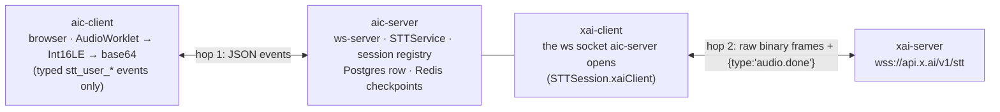
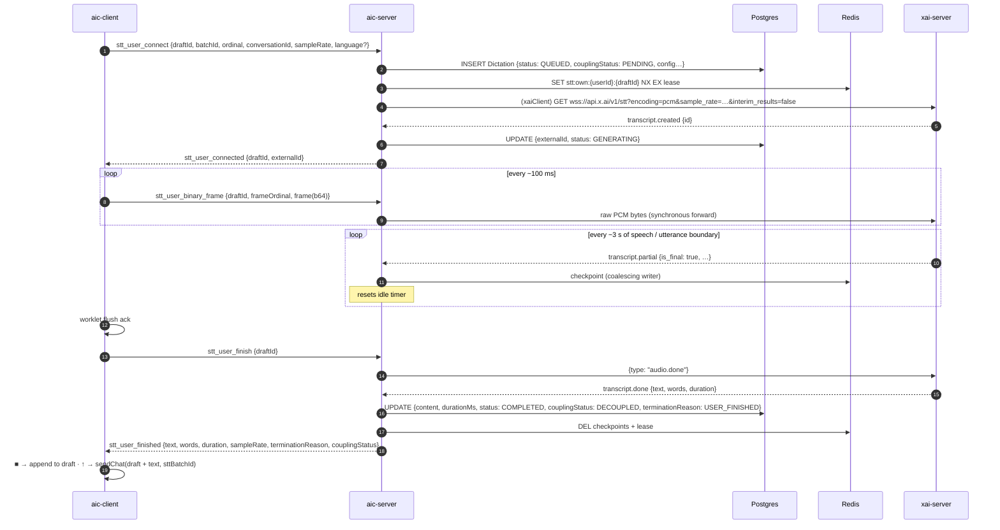
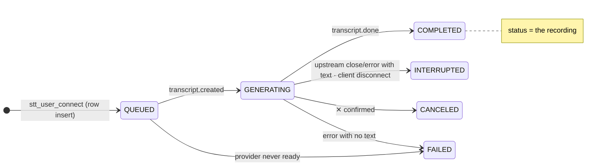
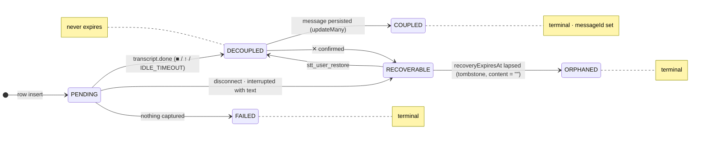
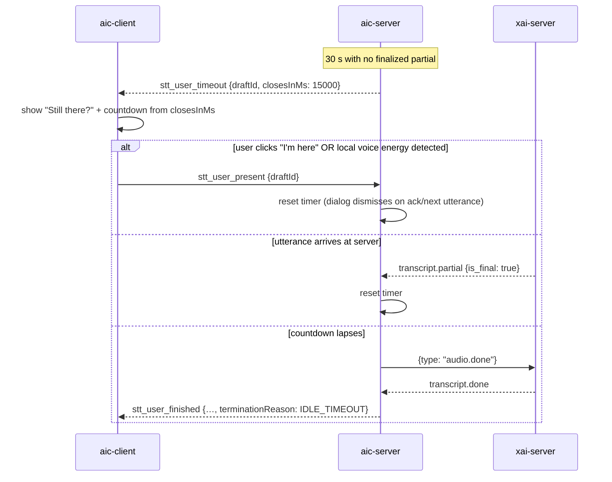
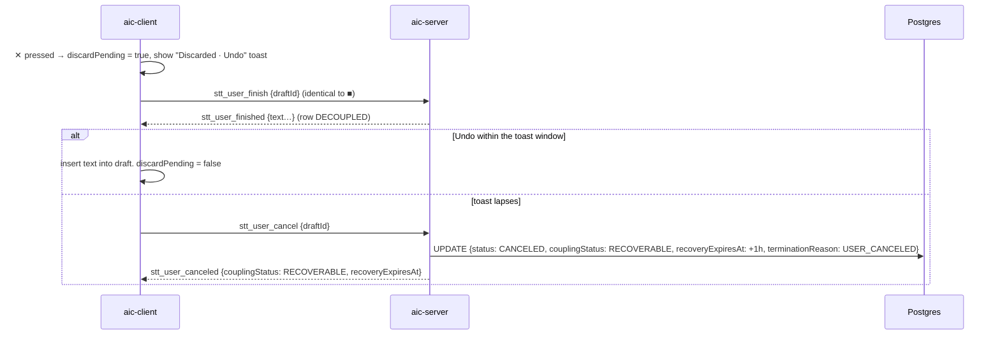
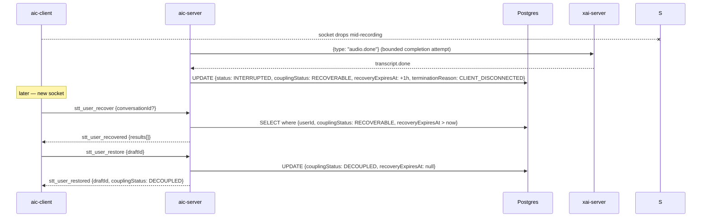
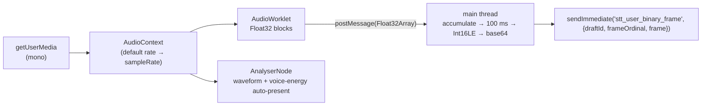

# STT Dictation Lane — Formalized Plan

**Status:** settled design, pre-implementation (2026-09-12). This document is
the single normative reference for the lane. `preliminary.md`,
`astra-init.md`, `fable-1.md`, `astra-2.md`, and `fable-2.md` remain as the
rationale trail; where they differ from this document, this document wins.

---

## 1. Purpose and scope

Microphone dictation in the chat composer, transcribed in real time by xAI's
streaming speech-to-text (`wss://api.x.ai/v1/stt`), relayed through the
ws-server over the user's existing authenticated chat socket. The transcript
lands in the composer as text the user can edit before sending. Raw provider
text is retained per dictation as provenance, so what the model heard can be
compared against what the user ultimately sent.

In scope: the relay, the persistence model, the browser capture pipeline,
the three-button dictation UI, transcript recovery after a dropped socket,
provenance retention. Out of scope for now: keyterm biasing (revisit later),
Opus encoding, diarization/multichannel, Smart Turn, any comparison metric
beyond storing the inputs for one.

## 2. Product requirements (fixed)

1. Query parameters are application configuration. Users never configure an
   audio pipeline.
2. A recording starts on mic tap and continues through thinking pauses.
   **There is no silence-based or duration-based automatic cutoff of any
   kind.** Only the user ends a recording.
3. Three controls, ChatGPT-style waveform bar replacing the composer:
   **✕ Cancel** discards (nothing returned); **■ Stop** returns the text to
   the draft without sending; **↑ Send** finishes transcription and submits
   through the normal chat flow.
4. A draft may contain typed text, pasted code, and multiple dictations, in
   any order.
5. Audio is transient — **never persisted** (privacy; two-party-consent
   jurisdictions). Raw *text* is persisted, per dictation, following the
   message's lifecycle.
6. The CLI follows identical rules and will gain dictation later; it is
   single-user today.

## 3. Provider contract (xAI streaming STT)

Reference: `reference.md` (copied 2026-09-11). Types: `apps/ws-server/src/stt/types.ts`.

- **Handshake:** `GET wss://api.x.ai/v1/stt?…` with `Authorization: Bearer`,
  configured entirely by query params; no setup message.
- **Client → provider:** binary frames (raw audio, ~100 ms each, no base64);
  `{"type":"audio.done"}` (terminal, exactly once → `transcript.done`);
  `{"type":"finalize"}` (optional, repeatable, locks the current utterance as
  `speech_final` while the session stays open).
- **Provider → client:** `transcript.created` (wait for it before sending
  audio), `transcript.partial` (`is_final` × `speech_final` = interim /
  chunk-final / utterance-final), `transcript.done` (final text, `duration`,
  connection closes after), `error`.
- **Type surface:** `STTTypes.Inbound` (the four JSON events),
  `STTTypes.Outbound` (`finalize` | `audio.done`), `STTTypes.AudioFrame`
  (`Buffer`; the binary frame has no `type` discriminant — `ws`'s `isBinary`
  is its only runtime discriminant), plus `UTR` records for both unions.
- **Documentation corrections:** `reference.md:241` says `transcript.done`
  where it means `audio.done`. The param is spelled `filler_words`. REST and
  streaming are separate contracts (`audio_format` vs `encoding`; VAD default
  `0.5` vs `0.08`; `format=true` is REST-only) — never mixed.
- **Probe-verified 2026-09-16:** `transcript.done.text` is the tail flushed
  by `audio.done`, **not** the cumulative transcript (a 41-char utterance
  arrived in the utterance-final `transcript.partial`; `done.text` was `""`
  with `duration` = the total). After `audio.done` the provider emits one
  more partial-final for the tail, then `done` repeating it. The §8.5
  reconciled segments are the transcript; `STTService.finalTranscript()`
  appends `done.text` only when the segments don't already end with it.

## 4. Application-owned configuration

| setting | value | rationale |
| --- | --- | --- |
| `encoding` | `pcm` | Int16LE mono, written explicitly from the worklet's float samples |
| `sample_rate` | the **actual capture-graph rate**, transmitted explicitly and validated (`isValidSampleRate`) | never label samples with a rate the graph didn't produce; unsupported graph rates recreate the graph at 48000 before the upstream session opens. 16 kHz is the documented native rate; accuracy across rates is **unmeasured** (probe §12). Cost is per audio minute, so rate is not a cost decision |
| `interim_results` | `false`, explicit | finalized `transcript.partial` events still arrive and are checkpointed internally; nothing is rendered mid-recording |
| `endpointing` | documented default | an utterance-boundary marker on results; it never stops capture and is not a UX-visible knob |
| `language` | validated formatting hint derived from the locale cookie (§9.4), else omitted | only enables number/currency formatting; the model transcribes any supported language regardless |
| `filler_words`, `smart_turn`, `smart_turn_timeout`, `diarize`, `multichannel`, `channels`, `vad_threshold`, `keyterm` | omitted | keyterms deferred; the storage column exists so the feature is representable |

URL construction uses `URLSearchParams` with explicit presence checks (never
`if (v)` — it drops `false` and `0`). `keyterm` is appended once per term.

## 5. Transport

- **Same authenticated chat socket.** No second upgrade path.
- **`isBinary` gate.** `ws` hands message listeners `(data, isBinary)`; the
  existing `onMessage(raw)` and `handleRawMessage` JSON-parse every frame.
  Binary frames are routed to the socket's live STT session *before* the JSON
  path; JSON events are unchanged. A `Buffer` check cannot substitute — text
  frames also arrive as `Buffer`.
- **Pre-auth inbox** (`preAuthInbox` in `ws-server/index.ts`) carries
  `{ raw, isBinary }` tuples through buffering and replay, and is **bounded by
  bytes and message count** (it is unauthenticated input; overflow closes the
  socket before auth). Audio routes only after auth and only to that socket's
  session.
- **Client `sendImmediate`.** The chat client's `send()` queues and replays on
  reconnect; STT controls and audio frames must never be queued or replayed.
  `sendImmediate` delivers when `OPEN` and otherwise fails into a visible
  *interrupted* state. `OPEN` means "attempted", not "delivered" — the
  application acknowledgments (§7) are the delivery signals.
- **`bufferedAmount` ceilings at both hops** (browser → ws-server, ws-server
  → xAI). A stalled hop interrupts the dictation explicitly; audio never
  accumulates behind chat traffic. These are transport limits, not duration
  limits.
- **Drain gate is type-aware.** The existing shutdown guard answers every
  frame with `user_tts_error`; STT traffic gets `user_stt_error` and its
  cleanup controls are honored during drain.

## 6. Identity and persistence model

### 6.1 Principle: the attachment pattern

Dictations behave exactly like uploaded attachments: rows are born from a
client-minted draft **before** the message exists, grouped by a `batchId`,
**coupled** to the message in the same request that persists the message,
and **decoupled** if abandoned. There is no container table — one row per
recording, `Message 1:N Dictation` (`Message.sttJobs Dictation[]`), exactly
as `Message 1:N Attachment`.

### 6.2 Identity

- `draftId = createDraftId(userId, conversationId, batchId, ordinal)` from
  `@slipstream/types` — the same helper attachments use; `parseDraftId`
  recovers the tuple server-side (ownership check = parse and compare against
  the socket's user). Minted **once** at recording start and never re-minted;
  the `conversationId` *column* is later set to the real id, the `draftId`
  *string* keeps its birth value.
- `batchId` is a **cuid2** (`@paralleldrive/cuid2` `createId()`, 24 chars,
  `[a-z0-9]`) — the same dialect as every Prisma `cuid(2)` id. Dictations may
  share the composer's attachment batch or carry their own; either passes the
  `[A-Za-z0-9_-]+` guard.
- **Fixed-width invariant.** With cuid2 components the draftId layout is
  deterministic: `24~24~24~ordinal` → ordinal at offset **75** for existing
  conversations, **59** when the middle component is the 8-char `new-chat`.
  Consequences: a length sanity check (`75 | 59`), positional `substr` in raw
  SQL, prefix matching served by the `draftId` index, and a free signal — a
  59-char draftId on a coupled row means it was born on new-chat. This
  invariant holds for dictations; attachment batches are `batch_<ms>` and stay
  variable-width unless migrated.
- `ordinal` = recording order within the batch (the composer's insertion
  order). `messageOrdinal` is **stamped at coupling** from the authoritative
  message ordinal — never predicted by the client.

### 6.3 Schema (target state; `packages/db/prisma/schema/dictation.prisma` is authoritative)

```prisma
enum DictationStatus         { QUEUED  GENERATING  COMPLETED  FAILED }
enum DictationCouplingStatus { PENDING COUPLED     DECOUPLED  FAILED }
enum DictationVersion        { v1_0 }
enum DictationEncoding       { PCM ALAW MULAW OPUS }

model Dictation {
  id               String  @id @default(cuid(2))
  draftId          String  @unique        // createDraftId(...) — client handle, frozen at mint
  batchId          String                 // cuid2, client-minted
  ordinal          Int                    // recording order within the batch
  userId           String
  conversationId   String?                // null on new-chat until coupling
  messageId        String?                // set at coupling
  messageOrdinal   Int?                   // stamped at coupling
  externalId       String?                // xAI transcript.created id — null until the provider is ready
  content          String                 // raw provider text; "" until transcript.done
  durationMs       Int     @default(0)
  status           DictationStatus         @default(QUEUED)
  couplingStatus   DictationCouplingStatus @default(PENDING)
  version          DictationVersion        @default(v1_0)
  // effective capture configuration (provenance)
  encoding         DictationEncoding @default(PCM)
  sampleRate       Int     @default(16000) // the transmitted graph rate
  inputSampleRate  Int?                    // browser-reported input-track rate, when exposed
  language         String?                 // null = omitted upstream (no formatting)
  keyterms         String?                 // "::"-delimited bare terms; null = unset (repo convention, tri-state)
  fillerWords      Boolean @default(false)
  diarize          Boolean @default(false)
  multichannel     Boolean @default(false)
  channels         Int     @default(1)
  interimResults   Boolean @default(false)
  endpointing      Int     @default(400)
  vadThreshold     Float   @default(0.08)
  smartTurn        Float?
  smartTurnTimeout Int?
  createdAt        DateTime @default(now())
  updatedAt        DateTime @updatedAt

  user         User          @relation(fields: [userId], references: [id], onDelete: Cascade)
  conversation Conversation? @relation(fields: [conversationId], references: [id], onDelete: Cascade)
  message      Message?      @relation("MessageDictation", fields: [messageId], references: [id], onDelete: Cascade)

  @@unique([batchId, ordinal])
  @@index([batchId, conversationId])
  @@index([userId, createdAt])
  @@index([conversationId, createdAt])
  @@index([messageId])
  @@index([externalId])
  @@index([status])
  @@index([couplingStatus])
  @@index([language])
}
```

Notes on deliberate choices:

- **`onDelete: Cascade` on `message`** is a knowing departure from
  `Attachment` (`SetNull`): a raw transcript of a deleted message is a
  liability, not a user asset. `SetNull` would also leave a row `COUPLED`
  with no message — an incoherent state.
- **Two status columns, two lifecycles.** `status` is the recording
  (`QUEUED → GENERATING → COMPLETED | FAILED`); `couplingStatus` is the
  association (`PENDING → COUPLED | DECOUPLED | FAILED`). `couplingStatus`
  defaults to `PENDING` — rows are born uncoupled.
- **`draftId @unique` and `@@unique([batchId, ordinal])` both.** The former
  is the client's lookup key; the latter is the semantic invariant (one
  recording per slot) and catches a re-mint bug the former would not.
- **`draftId` and `batchId` are required.** Attachments' are nullable only
  because that table is multi-origin (generated rows use
  `generationGroupId`/`seriesId`); `Dictation` is single-origin.
- **`keyterms` is `String?` with `::`**, matching `imagePages`/`annotPages`:
  Prisma scalar lists exist on this datasource but cannot be nullable, and
  unset-vs-empty is a meaningful distinction here. Store bare terms, never
  wire syntax; never write `""`; reject a term containing `::` at the write
  boundary.
- **`language` is nullable** because the design omits it upstream for
  unsupported locales; a default of `"en"` would record formatting that never
  happened.
- Two edits still pending on the live file at the time of writing:
  `externalId String → String?` and `language String @default("en") → String?`.

### 6.4 Row lifecycle

| moment | write |
| --- | --- |
| `user_stt_start` | **insert** `{ draftId, batchId, ordinal, userId, conversationId?, status: QUEUED, couplingStatus: PENDING, effective config }` — durable **before** the upstream socket opens, mirroring the user message being persisted before provider instantiation |
| `transcript.created` | `externalId`, `status: GENERATING` |
| `transcript.done` | `content`, `durationMs`, `status: COMPLETED` |
| provider error / never ready / interrupted | `status: FAILED` (with any checkpointed text in `content`); a null `externalId` on a failed row means the provider never acknowledged |
| ✕ confirmed (undo window lapsed) | **delete** the row — a cancelled dictation is text the user rejected without seeing it; no provenance value (no sent message to compare against), weakest retention claim in the lane. `CANCELED` in `DictationStatus` is unused unless a metadata-only tombstone (content cleared) is ever wanted for cancel-rate analytics |
| message persisted | **coupling** (§6.5) |

### 6.5 Coupling (association)

At the convergence point in `resolver/chat.ts`, after `handleAiChatRequest`
returns `requestMessageId` and the real `conversationId` — outside the
16-branch persistence matrix:

```ts
await prisma.dictation.updateMany({
  where: { batchId, userId, messageId: null, status: "COMPLETED" },
  data: { messageId, conversationId, messageOrdinal, couplingStatus: "COUPLED" }
});
```

- The request carries the dictation batch id (`sttBatchId?` on
  `AIChatRequest`, or the attachment `batchId` when shared — Andrew owns the
  contract in `events.ts`). A dictation-only batch routes harmlessly through
  the existing "with attachments" branches (their `findMany` returns `[]`).
- Coupling validates ownership (`parseDraftId` user vs socket user),
  completion, and prior coupling; repeat-to-same-message is idempotent;
  coupling to a different message is an explicit failure.
- The user message is durable before any provider work, so a predicted slot is
  never reused by a retry; coupling is deterministic.

### 6.6 Orphans

- **New-chat orphan:** `{ conversationId: null, messageId: null }` — swept
  aggressively (end of session, navigating away from new-chat, sign-out, lost
  connection) by that predicate alone; no placeholder string, no UI-event
  bookkeeping.
- **Existing-conversation, awaiting send:** `couplingStatus: DECOUPLED`,
  retained **indefinitely** — a draft sitting in a tab for twelve hours must
  send exactly as it would have twelve seconds in, warm caches and all.
  **Abandonment is event-driven, never time-driven:** there is no TTL, no
  age-based sweep. A row leaves `DECOUPLED` only on send (`COUPLED`) or an
  explicit discard — navigating away from new-chat, sign-out, cancel
  (`ORPHANED`). This is a retention decision (raw text the user never sent),
  bounded by the message lifecycle and explicit discards, not by time.
- Message deletion cascades; there is no orphan class from deletion.
- Coupling status lifecycle: `PENDING` (recording) → `DECOUPLED`
  (complete, eligible) → `COUPLED` | `ORPHANED`; `FAILED` from `PENDING` on
  provider failure. Three terminal states (`COUPLED`, `ORPHANED`, `FAILED`)
  never transition again; `messageId` is non-null on exactly one of them.

## 7. Application wire contract (v2)

Every control and result carries `draftId` (the client-minted identity). The
provider's session id is `externalId`, returned on `created`.

| dir | event | payload |
| --- | --- | --- |
| C→S | `user_stt_start` | `draftId`, `batchId`, `ordinal`, `conversationId?`, `sampleRate`, `inputSampleRate?`, `language?` |
| C→S | *binary frame* | `STTTypes.AudioFrame` — one ~100 ms PCM chunk |
| C→S | `user_stt_finish` | `draftId` |
| C→S | `user_stt_cancel` | `draftId` |
| C→S | `user_stt_recover` *(M2)* | `draftIds: string[]` — the bounded list the client's drafts still reference |
| S→C | `user_stt_created` | `draftId`, `externalId` |
| S→C | `user_stt_done` | `draftId`, `text`, `words`, `duration`, `sampleRate`, `storage: "stored" \| "unavailable"` |
| S→C | `user_stt_interrupted` | `draftId`, `text` (latest in-memory reconciled text), `reason`, `storage` |
| S→C | `user_stt_cancelled` | `draftId`, `storage: "deleted" \| "unconfirmed"` |
| S→C | `user_stt_recovered` *(M2)* | `results: { draftId, state: "completed" \| "interrupted" \| "missing" \| "owned", text? }[]` — no `expired`: rows never age out |
| S→C | `user_stt_error` | `draftId?`, `status`, `statusText` |

Uniform shapes; no branch-dependent fields. A client may advertise
recoverability only when `storage === "stored"`. `finalize` has no
application event; Stop and Send both end with one `audio.done`.
`Done.words` keeps `CTR<Words, "confidence">` until a real streaming result
says otherwise — confidence is never synthesized. `events.ts` is Andrew's
territory; the server is built against whatever lands there.

## 8. Server lifecycle

### 8.1 Service

`STTService(redis, logger, prisma, apiKey)` — S3 dropped (no asset); Redis
kept (convention + recovery). Constructed in the `exe()` composition root and
constructor-injected. Session registry keyed by client socket: one live
session per socket, reserved **synchronously** before any `await`; every
async callback checks session identity before touching state.

### 8.2 State machine

| state / trigger | behavior |
| --- | --- |
| starting / provider ready | `user_stt_created`; the client streams audio only after this |
| starting / cancel | abort setup, suppress the late ready/result, delete the row, `user_stt_cancelled` |
| recording / finish | client flushes the worklet (explicit ack) **then** sends `finish`; server sends one `audio.done`, awaits `transcript.done` |
| recording / ✕ | **two-phase discard:** the client finishes exactly as ■ (flush ack → `finish` → `audio.done` → `transcript.done`, row → `DECOUPLED`) with a local *discard-pending* flag and shows an "Undo" toast; the text arrives within the window. **Undo** inserts it normally (provenance intact, nothing server-side). **Window lapses** → client sends `user_stt_cancel` → server deletes the row + Redis state → `user_stt_cancelled`. With interim results off the browser holds no text mid-recording, so an abort-style cancel would leave nothing to undo |
| finishing / `transcript.done` | write the completed record → `user_stt_done` → cleanup once |
| finishing / duplicate finish | ignored; never a second `audio.done`, never a second submit |
| finishing / cancel | invalidate the pending result, discard state, suppress client auto-send |
| provider final received, storage pending, provider closes | normal completion — the close handler checks `finalReceived`; never `interrupted` |
| any / upstream close or `error` before done | **terminal by policy** (we close the upstream ourselves even for parse errors the provider would leave open); `user_stt_interrupted` with checkpointed text; `status: FAILED` |
| any / malformed or mismatched control (wrong `draftId`, duplicate finish) | `user_stt_error` naming the id; the live session is untouched |
| browser disconnects after finish accepted | bounded completion attempt; result stored for M2 recovery |
| stale callback from a replaced session | no-op |

Stop/Send are disabled in the UI until `user_stt_created`; Cancel is always
available; "starting" renders distinctly from "recording" so no words are
clipped that the UI implied were captured.

### 8.3 Deadlines — operational only

| wait | on expiry |
| --- | --- |
| provider readiness after `start` | `user_stt_error` |
| `transcript.done` after `audio.done` | `user_stt_interrupted` with latest text |
| any Redis state operation | proceed with `storage: "unavailable"` |
| browser gone after finish accepted | bounded completion, result stashed |

**None of these bound recording length or silence.** Capture streams samples
through silence; `speech_final` never ends anything. The provider's
documented "stream timeout" trigger is unspecified, so continuous silence
frames are a mitigation, not a guarantee — an upstream timeout surfaces as
`interrupted`, never as a silent stop.

### 8.4 Redis

Key `stt:{userId}:{draftId}`, record `SttRecordV1`: `v: 1`, `draftId`,
`externalId?`, `ownerRunId`, `leaseUntil`, `state: "active" | "completed" |
"interrupted"`, `text`, `segments: { text, start, duration }[]`,
`reconciled: boolean`, `settings: { encoding, sampleRate, language? }`,
`duration?`, `updatedAt`.

- **Single-slot coalescing writer with a synchronous terminal gate** — not a
  promise chain (a chain makes a late checkpoint the last write). The
  in-memory phase moves to terminal synchronously before any `await`;
  checkpoint admission checks it first. One `pending` slot holds the latest
  snapshot (captured by value); one write in flight; superseded snapshots are
  coalesced. The terminal write and cancel `DEL` go through the same writer
  after the slot clears. A failed write never poisons anything — it sets
  `storage: "unavailable"` and the lifecycle proceeds.
- **Storage deadline.** `RedisInstance` runs `disableOfflineQueue: false`, so
  a command issued during a reconnect stalls rather than fails. STT state ops
  run under the client's command timeout/abort; a timed-out command's outcome
  is uncertain and a late resolution may not reverse a cancellation. The
  shared client's policy is not changed globally.
- **Ownership lease.** `SET stt:own:{userId}:{draftId} {runId}:{sessionId}
  NX EX <lease>`, renewed with expiry renewal (silence renews too), held
  through the terminal write. Fresh `draftId` per recording; reuse across
  sockets is rejected; recovery is a **read**, never a `start` with an old id.
  Crash case: `active` + expired lease = abandoned (recoverable as
  interrupted); `active` + live lease = owned elsewhere.
- Completed record written **before** `user_stt_done`; Cancel releases the
  microphone immediately regardless of pending deletion and reports
  `storage: "deleted" | "unconfirmed"`.
- **Redis holds in-flight state only.** The Postgres row is the durable copy
  from `user_stt_start` onward, so Redis carries checkpoints and the
  ownership lease for a *live* recording and is released once the row
  reaches `DECOUPLED` or `FAILED`. Any Redis TTL is transient-session
  hygiene; nothing user-visible expires.

### 8.5 Checkpoint reconciliation

Utterance-finals may be stitched over earlier chunk-finals; the reference
does not promise disjoint or nested ranges. Rule: equal or fully-contained
range → replace; adjacent → append; partial non-nested overlap → retain both
and set `reconciled: false` rather than guess; empty finals ignored;
timestamps compared at the provider's 2-d.p. precision; `transcript.done`
always supersedes. The **live event trace is an M1 acceptance dependency**
for this claim.

### 8.6 Shutdown

Reject new sessions, settle or interrupt active ones, finish bounded state
writes, then quit Redis. STT participates in the same drain sequence TTS
does today.

## 9. Client

### 9.1 Capture

`AudioWorklet` on the default `AudioContext` (no forced rate); report
`audioContext.sampleRate` as the graph rate and the track's settings rate as
`inputSampleRate` when exposed. Explicit float → Int16LE with clamp and
quantize, little-endian writes, ~100 ms chunks sized from the graph rate and
real block lengths. Explicit worklet **flush acknowledgment** before `finish`;
on cancel the tail is discarded. Tracks, nodes, ports and the context are
released on every terminal path. Keep streaming samples during silence.

### 9.2 UI

Mic tap → waveform bar replaces the composer (bars driven by a client
`AnalyserNode`, no server text). "Starting" visibly distinct from
"recording". ✕ / ■ / ↑ as specified in §2. Send computes the final draft
value explicitly and passes it to the existing submission flow (no closure
over stale state); dictation ids ride the home→new-chat handoff; results bind
to their originating draft/conversation — navigating elsewhere while
finishing never inserts or submits into a different composer; auto-send
intent clears on interruption or recovery; an empty transcript never submits
unrelated existing text. Elapsed-time readout on the bar (a forgotten mic is
noticeable, never cut off).

### 9.3 Identity on the client

`createId()` (cuid2) for `batchId`; `createDraftId(userId, conversationId,
batchId, ordinal)` per recording, minted once at start. `hasUploads ||
hasDictations` decides whether the request carries a batch.

### 9.4 Language derivation (`useLangSTT`)

Pure `useMemo` over the locale cookie (`globalThis.navigator.language`
fallback, SSR-guarded) → `languageHelperSTT` (first subtag before `-`/`_`,
lowercased, anchored `^[a-z]{2,3}$`, `tl → fil` alias — BCP-47 puts the
language first, so `zh-Hant-TW → zh`, `fil-PH → fil`) → `isValidLangSTT`
(the 25 documented codes). Returns `{ lang, isSupported, sttLanguage }`;
`sttLanguage` is sent only when supported and the server re-validates. Banner
copy for unsupported locales says *formatting* is unavailable — dictation
still works. Planned to become a global context; the memo body is the
provider value unchanged. The allowlist should move to one `as const` array
in `@slipstream/types` when that happens (one roster, no third copy).

### 9.5 Manifest (captured at insertion, M1, no DB)

`DictationManifestV1`: `draftId`, `disposition: "returnedForEditing" |
"sentDirectly"` (*returnedForEditing* = the UI offered review, not proof of
review), `insertedAt: { draftRevision, rangeStart, rangeEnd }` (frozen
snapshot), `order`. Carried through the home→new-chat handoff; consumed by M3.

## 10. Provenance and comparison

Retention: raw provider text per dictation, coupled to the message, cascading
with it, never entering prompt construction or content logs. Note that it
preserves words the user removed before sending — a chosen consequence of the
model, bounded by the deletion lifecycle.

Comparison (M4) is **evidence about edits, never accuracy**: a direct `↑`
send yields distance 0 with zero review; a rewrite yields a large distance
after perfect recognition. Semi-global alignment against the sent content is
the exploratory measure, run **off the event-loop thread** (a worker or
strictly bounded work with real yielding — `void`-prefixing does not detach
CPU), bounded, nullable, with `unmatched | ambiguous | notComparable`
outcomes preserved, versioned normalization suited to technical text (naive
punctuation stripping mangles `C++` and `1.5`), originals always preserved.

## 11. Milestones

**M1 — relay, rows, coupling.** `STTService`; `isBinary` through a bounded
inbox; type-aware drain gate; row insert before the upstream socket opens;
status transitions; coalescing Redis writer + terminal gate + storage
deadline + ownership lease; contract v2 with `draftId` correlation;
exhaustive `switch` over `Inbound`; coupling `updateMany` at the convergence
point; `filler_words` rename. Client: worklet capture with flush ack,
`sendImmediate`, three controls, explicit draft value on Send, cuid2 batch +
`createDraftId`, manifest capture, `useLangSTT`.
*Acceptance:* long silence then speech; cancel before ready / during
recording / during finish / while storage pending; duplicate finish;
mismatched control against a live session; last short chunk preserved;
overlap fixtures plus the **live event trace**; binary and text replay
through auth with `isBinary` intact; inbox overflow; stale controls after
reconnect; same-user second socket reusing a `draftId` (rejected); provider
closes normally after `done` with storage pending (no false interrupted);
provider `error` terminal; Redis reconnect mid-session (deadline →
`unavailable`, text still delivered); shutdown with pending writes; slow
transport → interrupted, never silent; coupling of multiple dictations to one
message; new-chat orphan sweep.

**M2 — recovery.** Client-driven `user_stt_recover` with the bounded
`draftIds` its drafts reference; server resolves per §8.4 (`missing`,
`expired`, `owned` included); restore into the originating draft; interrupted
vs completed distinguished; never auto-submit restored text. Abandoned-draft
discovery after total local loss is a different feature and is not planned.

**M3 — provenance.** `sttDictations: DictationManifestV1[]` on the request;
disposition + insertion metadata persisted alongside the row the server
already owns; server raw text authoritative, client metadata is reported
interaction history.

**M4 — comparison.** As §10.

## 12. Probes (alongside M1; the event trace is acceptance, the rest quality)

1. Same source fixture **resampled** to 16 / 24 / 44.1 / 48 kHz (changing
   only the query param is not a resampling experiment), diffed against
   ground truth; then real browser capture; Stop-to-result latency recorded.
2. Whether `endpointing` changes final formatting or only segmentation.
3. `filler_words` behavior; the supported-language list vs our allowlist.
4. **Event trace** of utterance-finals vs chunk-finals with arrival times and
   audio ranges — receive events *while* sending; validate the WAV header
   rather than assuming 44 bytes; exercise long silence and the stop tail on
   the streaming endpoint itself.

## 13. Open items and owners

| item | owner |
| --- | --- |
| `events.ts` contract v2 (`user_stt_*`, `sttBatchId?` / `sttDictations?` on `AIChatRequest`) | Andrew |
| `dictation.prisma`: `externalId String?`, `language String?`, `user`/`conversation` relations + back-relations, indexes per §6.3; delete `dictation-block.prisma` after pulling nothing further (status enum already migrated) | Andrew |
| `@paralleldrive/cuid2` added to `apps/web` (currently ws-server only) | Andrew |
| `stt/types.ts`: `filter_words` → `filler_words` if any trace remains; `TTSWebSocket` alias → `STTWebSocket` | with M1 |
| language allowlist → one `as const` array in `@slipstream/types` | with the global-context refactor |
| M1 relay + client per §11 | Fable |

---

## Addendum A (2026-09-12) — idle close, `RECOVERABLE`, event renames

Supersedes the matching parts of §2, §6.3, §6.4, §6.6, §7, §8.2 and §8.3.

### A.1 Requirement 2, refined

No **silent** cutoff. A recording still never ends on silence alone — but a
recording with **no utterances for 30 s** (a server-side signal: no finalized
`transcript.partial` events) gets a prompted close: *"Still there? Dictation
will close in 15 s."* Any utterance or an explicit "I'm here" resets it. If
it lapses, the **server** sends `audio.done`, stamps
`terminationReason: IDLE_TIMEOUT`, and delivers the text so far exactly as
■ would — text is always returned, never discarded. Server-authoritative
because the client may be the party that went away. This also bounds
per-minute billing on a forgotten mic.

### A.2 Schema additions (live in `dictation.prisma`)

- `DictationCouplingStatus` + **`RECOVERABLE`** — ephemeral recovery
  available after a user cancel or a client disconnect.
- `DictationStatus` + **`INTERRUPTED`**; `CANCELED` retained for restoration
  of accidental cancels.
- **`DictationTerminationReason`** (`USER_FINISHED | IDLE_TIMEOUT |
  USER_CANCELED | CLIENT_DISCONNECTED | UPSTREAM_ERROR | INTERNAL_ERROR |
  NONE`) as `terminationReason @default(NONE)` — *how the recording ended*,
  orthogonal to *what state the row is in*.
- **`recoveryExpiresAt DateTime?`** — set **only** on entry to
  `RECOVERABLE` (1 h), null in every other state.
- `@@index([messageId, ordinal])` replaces `[messageId]`.

Termination → state mapping (keep the enums from drifting):

| `terminationReason` | `status` | `couplingStatus` |
| --- | --- | --- |
| `USER_FINISHED`, `IDLE_TIMEOUT` | `COMPLETED` | `DECOUPLED` (text returned to the draft) |
| `USER_CANCELED` | `CANCELED` | `RECOVERABLE` → `ORPHANED` on expiry |
| `CLIENT_DISCONNECTED` | `INTERRUPTED` | `RECOVERABLE` → `ORPHANED` on expiry |
| `UPSTREAM_ERROR`, `INTERNAL_ERROR` — text captured | `INTERRUPTED` | `RECOVERABLE` → `ORPHANED` on expiry (client present: delivered via `stt_user_interrupted`, restored via `stt_user_restore`) |
| `UPSTREAM_ERROR`, `INTERNAL_ERROR` — nothing captured | `FAILED` | `FAILED` |

### A.3 Expiry boundary (the no-expiry rule, made precise)

Draft state the user **kept** (`DECOUPLED`) never expires. Text the user
**cancelled or lost to a disconnect** (`RECOVERABLE`) is a one-hour safety
net. The sweep is `where: { couplingStatus: "RECOVERABLE", recoveryExpiresAt:
{ lt: now } }` — it cannot touch a `DECOUPLED` row by construction. On expiry
the row moves to `ORPHANED` as a **tombstone**: `content` cleared to `""`,
metadata retained. Cancel is therefore no longer a hard delete; it is
`RECOVERABLE` for an hour, then tombstoned. The client-side undo toast still
exists for the immediate case and needs no server round-trip.

### A.4 Wire contract — renamed `stt_user_*`, results carry persisted state

Binary audio frames remain **outside** `EventTypeMap`: every `AnyEvent`
member is a JSON frame with a `type` discriminant, a `Buffer` inside one
serializes to base64 (forbidden upstream, +33 % bytes, a parse per 100 ms),
and the frame's discriminant is `ws`'s `isBinary`. `STTTypes.AudioFrame` may
be re-exported from `@slipstream/types` for visibility but is not an event.

| dir | event | payload |
| --- | --- | --- |
| C→S | `stt_user_connect` | `draftId`, `batchId`, `ordinal`, `conversationId?`, `sampleRate`, `inputSampleRate?`, `language?`, `keyterms?: string[]` — server-owned config (`endpointing`, `diarize`, `fillerWords`, `vadThreshold`) stays off the wire unless explicitly a validated, clamped override |
| C→S | *binary frame* | raw PCM chunk; not an event |
| C→S | `stt_user_finish` | `draftId` |
| C→S | `stt_user_cancel` | `draftId` |
| C→S | `stt_user_resume` | `draftId` — "I'm here"; resets the idle timer |
| C→S | `stt_user_recover` *(M2)* | `draftIds: string[]` |
| S→C | `stt_user_connected` | `draftId`, `externalId` |
| S→C | `stt_user_idle` | `draftId`, `closesAt` (ISO) — opens the countdown dialog |
| S→C | `stt_user_active` | `draftId` — an utterance arrived; dismiss the dialog |
| S→C | `stt_user_finished` | `draftId`, `text`, `words`, `duration`, `sampleRate`, `terminationReason`, `couplingStatus` (`DECOUPLED`) |
| S→C | `stt_user_interrupted` | `draftId`, `text`, `terminationReason`, `couplingStatus` (`RECOVERABLE`), `recoveryExpiresAt` |
| S→C | `stt_user_canceled` | `draftId`, `couplingStatus` (`RECOVERABLE`), `recoveryExpiresAt` |
| S→C | `stt_user_recovered` *(M2)* | `results: { draftId, state: "completed" \| "interrupted" \| "missing" \| "owned", text? }[]` |
| S→C | `stt_user_error` | `draftId`, `status`, `statusText` |

The former `storage: "stored" | "unavailable" | "deleted" | "unconfirmed"`
fields are gone: the DB row is the truth, results carry the **persisted**
`couplingStatus` (plus `recoveryExpiresAt` where it applies), and a failed
content write after `transcript.done` surfaces as `stt_user_error` rather
than a soft flag.

### A.5 State-machine additions

| trigger | behavior |
| --- | --- |
| recording / 30 s without a finalized utterance | `stt_user_idle { closesAt: now + 15 s }`; timer is server-owned |
| idle / utterance or `stt_user_resume` | reset; `stt_user_active` so the dialog dismisses |
| idle / `closesAt` reached | server sends `audio.done`; `terminationReason: IDLE_TIMEOUT`; `stt_user_finished` — identical to ■ |
| any active state / client disconnect | bounded completion attempt; row → `INTERRUPTED` / `RECOVERABLE` / `recoveryExpiresAt = now + 1 h`; `terminationReason: CLIENT_DISCONNECTED` |
| recording / ✕ confirmed | row → `CANCELED` / `RECOVERABLE` / `recoveryExpiresAt = now + 1 h`; `terminationReason: USER_CANCELED` |
| sweep / `RECOVERABLE` past `recoveryExpiresAt` | → `ORPHANED`, `content = ""` |

### A.6 Relay topology — four parties, typed on hop 1, raw on hop 2

```
aic-client  ⇄(1)⇄  aic-server  ⇄(2)⇄  xai-client  ⇄  xai-server
```

- **Hop 1 (aic-client ⇄ aic-server): every frame is a typed `EventTypeMap`
  event.** Audio travels as `stt_user_binary_frame` (or `stt_user_audio_frame`)
  `{ draftId, ordinal, frame: string /* base64 */ }`. `Buffer` is not a wire
  type — it doesn't exist in the browser and stringifies to a number array —
  so the field is base64 (~+33 %, ~128 KB/s at 48 kHz PCM16; trivial). The
  frame goes through the ordinary JSON dispatch like any other event.
- **Hop 2 (xai-client ⇄ xai-server): raw binary only.** `Buffer.from(frame,
  "base64")` forwarded as a binary WebSocket frame, no event wrapper.
- **Withdrawn:** the `isBinary` gate on the chat socket, the `{ raw, isBinary }`
  pre-auth inbox tuple, and the objection to typing the frame. The inbox
  byte/message bound stands on its own merits.
- **Ordering:** the audio handler forwards **synchronously** — no `await`
  between dispatch and `xaiWs.send` — so hop-2 order equals hop-1 order.
  `ordinal` is a gap/duplicate detector (interrupt on a gap), not a reorder
  buffer.
- **`sendImmediate`** is a typed sibling of the client's `send` (same
  `EventTypeMap` signature), never queued, never replayed; used for the audio
  event and all STT controls. `bufferedAmount` ceilings apply on both hops.

### A.7 Navigation, recovery query, and the end of new-chat special-casing

- **Navigation never implies cancel.** Cancel is an explicit user intent; leaving
  the page expresses nothing about the text, so the default is always
  *preserve*. Socket alive (in-app route change) → client sends
  `stt_user_finish` (implicit ■); the result binds to its originating draft
  (§9.2), the row lands `DECOUPLED` with the originating `conversationId`
  (null for new-chat) and waits without expiry. Socket dead (tab close /
  crash) → the server close handler runs a bounded completion attempt
  (`audio.done` → `transcript.done`), stores the text, marks `INTERRUPTED /
  RECOVERABLE / recoveryExpiresAt = +1 h / CLIENT_DISCONNECTED`; `pagehide`
  may still try `stt_user_finish` as best effort.
- **Draft hydration.** Returning to a conversation reloads its uncoupled
  dictations — `{ userId, conversationId (null = new-chat), couplingStatus:
  "DECOUPLED" }` — exactly as uncoupled attachments return to the composer.
  The row is the draft persistence.
- **`stt_user_recover` takes no draftIds** — recovery matters most when local
  state is gone. Server query: `{ userId, couplingStatus: "RECOVERABLE",
  recoveryExpiresAt: { gt: now } }`, optional `conversationId` scope
  (`null` = new-chat). Results carry `draftId`, `batchId`, `ordinal`,
  `conversationId`, `text`, `terminationReason`, `recoveryExpiresAt`,
  `createdAt` (numbers as epoch ms). Consumption is `stt_user_restore
  { draftId }` → `DECOUPLED`, `recoveryExpiresAt → null`; dismissal is
  simply expiry into the tombstone.
- **`stt_user_canceled`** is the ack for `stt_user_cancel` and carries no text
  (it already arrived via `stt_user_finished`): `{ draftId,
  terminationReason: USER_CANCELED, couplingStatus: RECOVERABLE | ORPHANED,
  recoveryExpiresAt: number | null }` — `ORPHANED` + `null` when there was
  nothing to keep (✕ during starting / zero utterances), tombstoned
  immediately rather than hard-deleted so the ack shape stays uniform.
- **New-chat is no longer special-cased anywhere.** The aggressive orphan
  sweep in §6.6 existed only for the `("new-chat", 0)` collision under the
  ordinal-derived identity; cuid2 `batchId`s make every new-chat row unique,
  so it is treated exactly like any conversation. §6.6's new-chat predicate is
  withdrawn.
- Timing numbers on the wire are **ms** (`closesInMs` relative for the idle
  probe — skew-proof; `recoveryExpiresAt`/`createdAt` epoch ms).

---

## Addendum B (2026-09-13) — Step-by-step implementation, with diagrams

Everything below is M1 unless marked. Snippets are skeletons in the repo's
dialect (`satisfies`/`as const`, class methods, constructor injection,
structured logger) — shapes to build against, not drop-in code.

### B.0 The four nodes



### B.1 Happy path (■ Stop / ↑ Send)



### B.2 Row state machines





### B.3 Idle probe



### B.4 ✕ Cancel — two-phase with undo



### B.5 Disconnect → recover → restore (M1 server side, M2 client UI)



---

### Step 1 — contract wiring (types package) — ✅ done

Fold the union into `AnyEvent` in `contract/index.ts` so `EventTypeMap`
gains the fifteen `stt_user_*` keys; nothing else in the package changes.

```ts
// packages/types/src/contract/index.ts
export type AnyEvent =
  | AIChatEventUnion
  | AssetEventUnion
  | STTEventUnion
  | TTSEventUnion
  | …;
```

Consumers with exhaustive `Record<AnyEvent["type"], …>` maps (the CLI's
dispatcher) gain no-op entries when they're next touched.

### Step 2 — `STTService` skeleton (ws-server)

Constructed in `exe()`, constructor-injected `(redis, logger, prisma,
apiKey)`; one live session per client socket; the registry entry is reserved
**synchronously** before any `await`.

```ts
// apps/ws-server/src/stt/index.ts
interface STTSession {
  readonly draftId: string;
  readonly userId: string;
  readonly ws: WebSocket;              // hop 1 — the aic-client socket
  xaiClient: WebSocket | null;         // hop 2 — null until opened
  phase: "starting" | "recording" | "finishing" | "terminal";
  expectedFrameOrdinal: number;
  lastUtteranceAt: number;
  idleTimer: NodeJS.Timeout | null;
  closeTimer: NodeJS.Timeout | null;
  finalReceived: boolean;
  segments: { text: string; start: number; duration: number }[];
}

export class STTService {
  private readonly sessions = new Map<WebSocket, STTSession>();

  constructor(
    protected redis: EnhancedRedisPubSub,
    logger: LoggerService,
    protected prisma: PrismaService,
    protected apiKey: string
  ) { /* pino child as TTS does */ }

  public async connect(ws: WebSocket, userId: string, ev: EventTypeMap["stt_user_connect"]) {
    if (this.sessions.has(ws)) {
      ws.send(JSON.stringify({ type: "stt_user_error", draftId: ev.draftId, status: 409, statusText: "session already live" } satisfies EventTypeMap["stt_user_error"]));
      return;
    }
    const [ownerId] = parseDraftId(ev.draftId);
    if (ownerId !== userId) {
      ws.send(JSON.stringify({ type: "stt_user_error", draftId: ev.draftId, status: 403, statusText: "draft owner mismatch" } satisfies EventTypeMap["stt_user_error"]));
      return;
    }

    const session = { draftId: ev.draftId, userId, ws, xaiClient: null,
      phase: "starting", expectedFrameOrdinal: 0, lastUtteranceAt: Date.now(),
      idleTimer: null, closeTimer: null, finalReceived: false,
      segments: Array.of<{ text: string; start: number; duration: number }>()
    } satisfies STTSession;
    this.sessions.set(ws, session);                     // reserved before any await

    await this.prisma.dictationInsert({ ...ev, userId }); // row durable BEFORE the provider
    const leased = await this.redis.setNx(`stt:own:${userId}:${ev.draftId}`, this.runId, LEASE_S);
    if (!leased) return this.fail(session, "INTERNAL_ERROR", "draftId already owned");

    this.openXaiClient(session, ev);
  }
}
```

### Step 3 — xai-client socket + exhaustive inbound switch

```ts
private buildUrl(ev: EventTypeMap["stt_user_connect"]) {
  const params = new URLSearchParams();
  params.set("encoding", "pcm");
  params.set("sample_rate", String(ev.sampleRate));
  params.set("interim_results", "false");
  if (typeof ev.language === "string" && this.isValidLanguage(ev.language)) {
    params.set("language", ev.language);
  }
  for (const k of ev.keyterms ?? []) params.append("keyterm", k);
  return `${this.baseSTTUrl}?${params.toString()}`;
}

private openXaiClient(session: STTSession, ev: EventTypeMap["stt_user_connect"]) {
  const xaiClient = new STTWebSocket(this.buildUrl(ev), {
    headers: { Authorization: `Bearer ${this.apiKey}` }
  });
  session.xaiClient = xaiClient;

  xaiClient.on("message", (raw: RawData) => {
    if (this.sessions.get(session.ws) !== session) return;   // stale callback guard
    const event = JSON.parse<STTTypes.Inbound>(raw.toString());
    switch (event.type) {
      case "transcript.created": {
        session.phase = "recording";
        void this.prisma.dictationTransition(session.draftId, { externalId: event.id, status: "GENERATING" });
        this.armIdleTimer(session);
        return this.send(session.ws, "stt_user_connected", { draftId: session.draftId, externalId: event.id });
      }
      case "transcript.partial": {
        if (!event.is_final) return;                              // never expected with interims off
        session.lastUtteranceAt = Date.now();
        this.armIdleTimer(session);
        this.checkpoint(session, event);                          // §8.5 reconciliation + coalescing writer
        return;
      }
      case "transcript.done": {
        session.finalReceived = true;
        return void this.complete(session, event, "USER_FINISHED");
      }
      case "error": {
        return void this.interrupt(session, "UPSTREAM_ERROR", event.message);
      }
    }
  });

  xaiClient.on("close", () => {
    if (session.finalReceived || session.phase === "terminal") return;   // normal close after done
    void this.interrupt(session, "UPSTREAM_ERROR", "xai-server closed before transcript.done");
  });
}
```

### Step 4 — frame relay (synchronous forward, ordinal gap detection)

```ts
public pushFrame(ws: WebSocket, ev: EventTypeMap["stt_user_binary_frame"]) {
  const session = this.sessions.get(ws);
  if (!session || session.draftId !== ev.draftId) return;          // stale tail from a replaced session → drop
  if (session.phase !== "recording" || !session.xaiClient) return;
  if (ev.frameOrdinal < session.expectedFrameOrdinal) return;       // duplicate
  if (ev.frameOrdinal > session.expectedFrameOrdinal) {
    return void this.interrupt(session, "INTERNAL_ERROR", `frame gap at ${session.expectedFrameOrdinal}`);
  }
  session.expectedFrameOrdinal += 1;
  if (session.xaiClient.bufferedAmount > MAX_XAI_CLIENT_BUFFER) {
    return void this.interrupt(session, "INTERNAL_ERROR", "xai-client stalled");
  }
  session.xaiClient.send(Buffer.from(ev.frame, "base64"), { binary: true }); // no await before this line
}
```

### Step 5 — finish / cancel / present / idle

```ts
public finish(ws: WebSocket, ev: EventTypeMap["stt_user_finish"], reason: "USER_FINISHED" | "IDLE_TIMEOUT" = "USER_FINISHED") {
  const session = this.sessions.get(ws);
  if (!session || session.draftId !== ev.draftId) {
    ws.send(JSON.stringify({ type: "stt_user_error", draftId: ev.draftId, status: 404, statusText: "no live session for draftId" } satisfies EventTypeMap["stt_user_error"]));
    return;
  }
  if (session.phase !== "recording") return;                         // duplicate finish → ignored
  session.phase = "finishing";                                        // synchronous terminal-ward gate
  this.clearTimers(session);
  session.pendingReason = reason;
  session.xaiClient?.send(JSON.stringify({ type: "audio.done" } satisfies STTTypes.OutboundRecord["audio.done"]));
  this.armFinishDeadline(session);                                    // operational: transcript.done must arrive
}

public async cancel(ws: WebSocket, ev: EventTypeMap["stt_user_cancel"]) {
  const row = await this.prisma.dictationFind(ev.draftId);
  const keep = row.status === "COMPLETED" && row.content.length > 0;
  const next = keep
    ? { status: "CANCELED", couplingStatus: "RECOVERABLE", recoveryExpiresAt: new Date(Date.now() + HOUR_MS) }
    : { status: "CANCELED", couplingStatus: "ORPHANED", content: "", recoveryExpiresAt: null };
  await this.prisma.dictationTransition(ev.draftId, { ...next, terminationReason: "USER_CANCELED" });
  this.send(ws, "stt_user_canceled", {
    draftId: ev.draftId, terminationReason: "USER_CANCELED",
    couplingStatus: next.couplingStatus,
    recoveryExpiresAt: next.recoveryExpiresAt?.getTime() ?? null
  });
}

public present(ws: WebSocket, ev: EventTypeMap["stt_user_present"]) {
  const session = this.sessions.get(ws);
  if (!session || session.draftId !== ev.draftId) return;
  session.lastUtteranceAt = Date.now();
  this.armIdleTimer(session);                                         // clears the close timer too
}

private armIdleTimer(session: STTSession) {
  this.clearTimers(session);
  session.idleTimer = setTimeout(() => {
    this.send(session.ws, "stt_user_timeout", { draftId: session.draftId, closesInMs: CLOSE_MS });
    session.closeTimer = setTimeout(
      () => this.finish(session.ws, { type: "stt_user_finish", draftId: session.draftId }, "IDLE_TIMEOUT"),
      CLOSE_MS
    );
  }, IDLE_MS);
}
```

### Step 6 — completion, interruption, socket close

```ts
private async complete(session: STTSession, done: STTTypes.Transcript.Done, reason: STTTypes.FinishReason) {
  session.phase = "terminal";
  this.clearTimers(session);
  await this.prisma.dictationTransition(session.draftId, {
    content: done.text, durationMs: Math.round(done.duration * 1000),
    status: "COMPLETED", couplingStatus: "DECOUPLED", terminationReason: reason
  });
  await this.releaseRedis(session);
  this.send(session.ws, "stt_user_finished", {
    draftId: session.draftId, text: done.text, words: done.words, duration: done.duration,
    sampleRate: session.sampleRate, couplingStatus: "DECOUPLED", terminationReason: reason
  });
  this.teardown(session);
}

private async interrupt(session: STTSession, reason: "UPSTREAM_ERROR" | "INTERNAL_ERROR", why: string) {
  if (session.phase === "terminal") return;
  session.phase = "terminal";
  this.clearTimers(session);
  const { text, words, duration } = this.reconciled(session.segments);   // §8.5
  const keep = text.length > 0;
  await this.prisma.dictationTransition(session.draftId, keep
    ? { content: text, status: "INTERRUPTED", couplingStatus: "RECOVERABLE", recoveryExpiresAt: new Date(Date.now() + HOUR_MS), terminationReason: reason }
    : { status: "FAILED", couplingStatus: "FAILED", terminationReason: reason });
  this.logger.warn({ draftId: session.draftId, reason, why }, "stt interrupted");
  this.send(session.ws, "stt_user_interrupted", { /* per contract */ });
  this.teardown(session);
}

/** called from the ws-server close handler alongside localToolBroker.dropSocket */
public handleSocketClose(ws: WebSocket) {
  const session = this.sessions.get(ws);
  if (!session || session.phase === "terminal") return;
  // bounded completion attempt: aic-client is gone, xai-client is not
  session.phase = "finishing";
  session.disconnected = true;                                        // complete() stores as INTERRUPTED/RECOVERABLE, sends nothing
  session.xaiClient?.send(JSON.stringify({ type: "audio.done" } satisfies STTTypes.OutboundRecord["audio.done"]));
  this.armFinishDeadline(session);
}
```

### Step 7 — Redis: coalescing writer with terminal gate (§8.4)

```ts
private checkpoint(session: STTSession, ev: STTTypes.Transcript.Partial) {
  if (session.phase === "terminal") return;                            // gate: terminal rows admit nothing
  session.segments = this.reconcile(session.segments, ev);
  session.pendingSnapshot = this.snapshot(session);                    // captured by value; overwrites the slot
  if (!session.writeInFlight) void this.drain(session);
}

private async drain(session: STTSession) {
  while (session.pendingSnapshot) {
    const snap = session.pendingSnapshot;
    session.pendingSnapshot = null;
    session.writeInFlight = true;
    try {
      await this.redis.setWithDeadline(`stt:${session.userId}:${session.draftId}`, snap, STORAGE_DEADLINE_MS);
    } catch (err) {
      this.logger.warn({ draftId: session.draftId, err: this.prisma.safeErrMsg(err) }, "checkpoint write failed");
    } finally {
      session.writeInFlight = false;
    }
  }
}
```

### Step 8 — dispatch + resolver

`resolver/dispatch.ts` gains the `stt_user_*` cases in its allowlist and
`resolver/stt.ts` mirrors `resolver/tts.ts` — each handler validates the
payload's client-supplied fields (`sampleRate` via `isValidSampleRate`,
`language` via `isValidLanguage`, config overrides clamped) then calls the
service. The audio frame handler must stay **synchronous** end to end
(`pushFrame` has no `await`), so hop-2 order equals hop-1 order.

```ts
// resolver/dispatch.ts (excerpt)
case "stt_user_connect":      return this.handleSttConnect(event, ws, userId);
case "stt_user_binary_frame": return this.sttService.pushFrame(ws, event);   // sync
case "stt_user_finish":       return this.sttService.finish(ws, event);
case "stt_user_cancel":       return this.sttService.cancel(ws, event);
case "stt_user_present":      return this.sttService.present(ws, event);
case "stt_user_recover":      return this.handleSttRecover(event, ws, userId); // M2
case "stt_user_restore":      return this.handleSttRestore(event, ws, userId); // M2
```

The drain gate becomes type-aware: `stt_user_*` traffic during shutdown gets
`stt_user_error`, and `finish`/`cancel` are still honored.

### Step 9 — coupling at the convergence point

After `handleAiChatRequest` returns, in `resolver/chat.ts` — outside the
16-branch matrix:

```ts
if (typeof request.sttBatchId === "string") {
  await this.wsServer.prisma.dictationCouple({
    where: { batchId: request.sttBatchId, userId, couplingStatus: "DECOUPLED" },
    data: { messageId: requestMessageId, conversationId, messageOrdinal, couplingStatus: "COUPLED" }
  });
}
```

(`updateMany` under the hood; idempotent on repeat; a missing/expired batch
never blocks the chat message.)

### Step 10 — client: `sendImmediate`

```ts
// apps/web/src/utils/chat-ws-client.ts
public sendImmediate<const T extends keyof EventTypeMap>(event: T, data: EventTypeMap[T]) {
  if (this.socket?.readyState !== WebSocket.OPEN) return false;      // never queued, never replayed
  if (this.socket.bufferedAmount > MAX_CLIENT_BUFFER) return false;  // stalled hop 1 → caller interrupts
  this.socket.send(JSON.stringify({ ...data, type: event } satisfies EventTypeMap[T] & { type: T }));
  return true;
}
```

### Step 11 — client: capture pipeline



```ts
// worklet (registered via audioWorklet.addModule)
class PcmTapProcessor extends AudioWorkletProcessor {
  process(inputs: Float32Array[][]) {
    const ch0 = inputs[0]?.[0];
    if (ch0) this.port.postMessage(ch0.slice());                     // copy — the buffer is reused
    return true;
  }
}
registerProcessor("pcm-tap", PcmTapProcessor);
```

```ts
// main thread: explicit float → Int16LE, then base64
function toInt16Le(f32: Float32Array) {
  const out = new Uint8Array(f32.length * 2);
  const view = new DataView(out.buffer);
  for (let i = 0; i < f32.length; i++) {
    const s = Math.max(-1, Math.min(1, f32[i] ?? 0));
    view.setInt16(i * 2, s < 0 ? s * 0x8000 : s * 0x7fff, true);    // little-endian
  }
  return out;
}
function toBase64(bytes: Uint8Array) {
  let bin = "";
  for (const b of bytes) bin += String.fromCharCode(b);
  return btoa(bin);
}
// accumulate worklet blocks until sampleRate / 10 samples, then:
client.sendImmediate("stt_user_binary_frame", { draftId, frameOrdinal: seq++, frame: toBase64(toInt16Le(chunk)) });
```

Flush ack before finish: post `{ cmd: "flush" }` to the worklet, wait for its
`{ ack: "flushed" }`, drain the accumulator (send the short tail as a final
frame), *then* `sendImmediate("stt_user_finish", …)`. On cancel the tail is
discarded.

### Step 12 — client: state + UI

```ts
type DictationPhase = "idle" | "starting" | "recording" | "finishing" | "timeoutPrompt";

// useDictation() — a context sibling of AudioGenProvider; one active dictation per composer
const start = () => { draftId = createDraftId(userId, conversationId ?? "new-chat", batchId, ordinal++); /* row born server-side */ };
const on = {
  stt_user_connected:   () => setPhase("recording"),                 // ■/↑ enable here; ✕ always enabled
  stt_user_timeout:     e  => { setPhase("timeoutPrompt"); startCountdown(e.closesInMs); },
  stt_user_finished:    e  => discardPending ? holdForUndo(e) : intent === "send" ? sendChat(draft + e.text, { sttBatchId: batchId }) : appendToDraft(e.text),
  stt_user_interrupted: e  => offerRestore(e),                        // partial text → user decides
  stt_user_canceled:    e  => dropLocalRef(e.draftId),
  stt_user_error:       e  => surfaceInterrupted(e),
};
```

- **Send** computes the final draft value explicitly and passes it to the
  existing `sendChat` (no closure over stale state); `hasUploads ||
  hasDictations` decides whether the request carries a batch.
- **Navigation** while recording → `stt_user_finish` (implicit ■), result
  bound to the originating draft; on return, hydrate `DECOUPLED` rows for
  that conversation into the composer.
- **Timeout dialog** counts down from `closesInMs` locally; "I'm here" *or*
  `AnalyserNode` voice energy → `stt_user_present`.

### Step 13 — sweep (RECOVERABLE → ORPHANED tombstone)

Interval job in the ws-server composition root; never touches `DECOUPLED`:

```ts
await prisma.dictation.updateMany({
  where: { couplingStatus: "RECOVERABLE", recoveryExpiresAt: { lt: new Date() } },
  data:  { couplingStatus: "ORPHANED", content: "", recoveryExpiresAt: null }
});
```

### Step 14 — acceptance (M1)

- [ ] long silence then speech; idle probe → present resets; lapse → `IDLE_TIMEOUT` finish with text
- [ ] ✕ before ready → `ORPHANED`/null; ✕ after text → toast → undo inserts; lapse → `RECOVERABLE`
- [ ] duplicate finish ignored; mismatched `draftId` → `stt_user_error`, session untouched
- [ ] frame gap → interrupted; duplicate frame → dropped; stale-session frame → dropped
- [ ] last short chunk preserved (flush ack)
- [ ] provider closes after `transcript.done` with storage pending → no false interrupted
- [ ] provider `error` → `INTERRUPTED/RECOVERABLE` with text, `FAILED/FAILED` without
- [ ] socket drop mid-recording → server completes → `RECOVERABLE`; `recover`/`restore` round-trip
- [ ] Redis reconnect mid-session → checkpoint write times out, lifecycle proceeds
- [ ] shutdown with pending writes → type-aware drain
- [ ] two dictations in one batch couple to one message; sweep tombstones expired `RECOVERABLE` only
- [ ] **live event trace** confirms the §8.5 overlap rule
